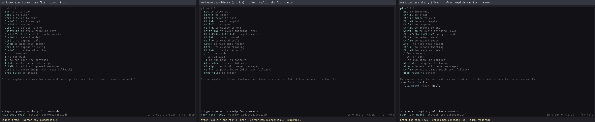
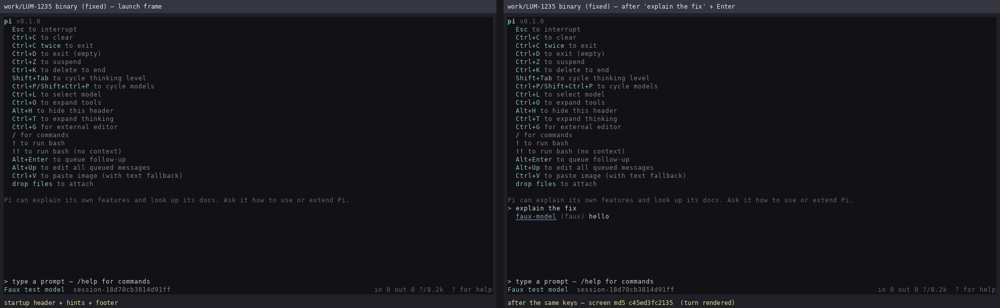
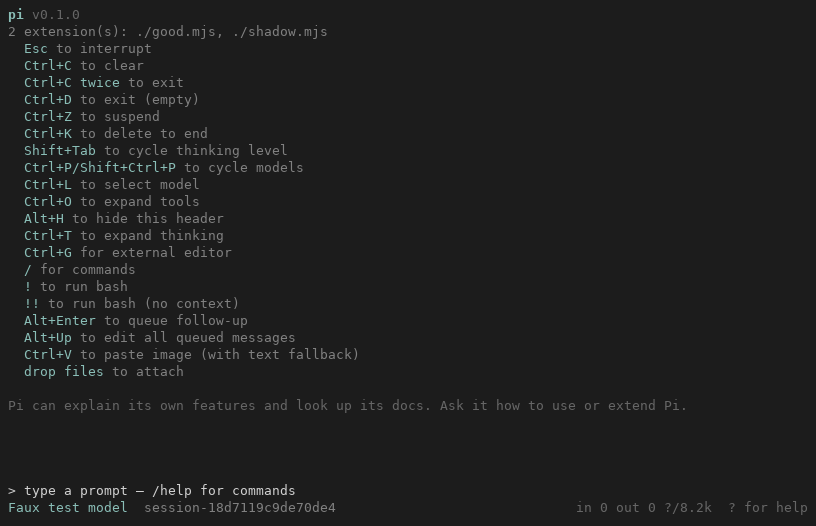
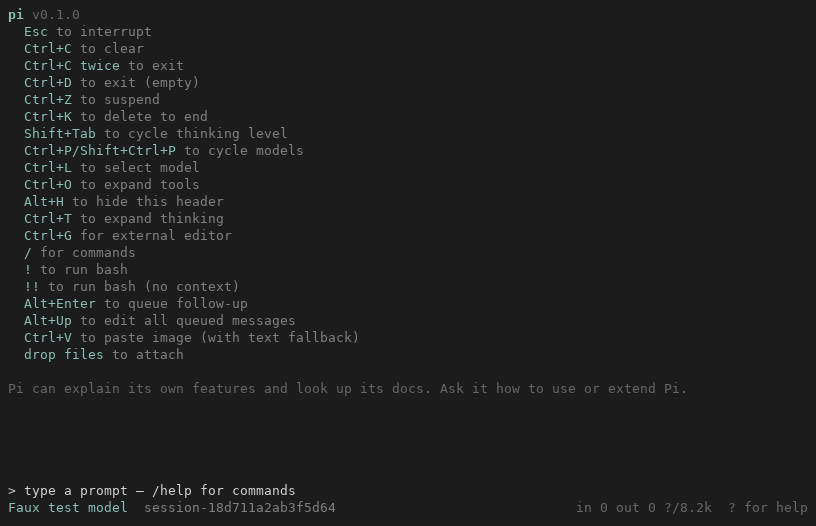

# pi-rust TUI 用户体验审计（首轮）

审计对象：`pi-rust/crates/pi-tui` + `pi-rust/crates/pi-coding-agent` 的交互模式（alt-screen TUI）。
对照物：上游 TS `packages/coding-agent/src/modes/interactive/interactive-mode.ts`、
`packages/tui/src/tui-alt-screen.ts`，以及 [Martty](https://github.com/louloulin/Martty)（ratatui 实现的
DeepSeek Harness TUI）。

本文件是可执行的差距清单：每条都给出「证据 → 影响 → 修复方向 → 风险」，第五节是可直接派给
worker 的 stage 划分。

## 结论

1. 渲染底座已经不缺：`pi-tui` 27,895 行、30 个模块，markdown / 高亮 / 主题 / 搜索 / 鼠标选词
   / 滚动条 / 选择器 / 设置弹窗 / 图片（kitty & iTerm2）/ 扩展 UI 都有，测试面也很宽。
2. 真正的差距在「交互编排」：43 个 `app.*` 键位只消费了 3 个（`app.interrupt`、`app.clear`、
   `app.exit`），上游 23 个内置斜杠命令 Rust 只实现了 11 个（本轮补到 12）。
3. 影响最大的一条是**工具输出没有折叠/展开**：交互 TUI 把所有工具结果拍成一行
   `[tool:name] args → result`，一个 `read` 或 `bash` 就能刷满整个会话。
4. 仓库里已经有 2,269 行上游风格的工具渲染器（`crates/pi-coding-agent/src/tools/render.rs`，
   带折叠、高亮、`render_lines_plain`/`render_lines_ansi`），但只被 print 模式和 HTML 导出使用，
   交互 TUI 完全没接上 —— 这是「已有零件没装机」，不是「要从零造」。
5. 同时发现一个静默的确定性缺陷：`Models` 内部是 `HashMap`，`/model` 列表顺序、`default_model`
   的选择结果每次都不同。本轮已修（见第四节）。
6. 第二轮审计（LUM-1215）把 P1-3 从「缺功能」升级为**确定性缺陷**：流式期间在编辑器里敲
   Enter，文本会被静默丢弃 —— 编辑器先清空，`App::submit` 再因忙直接 `return`
   （`crates/pi-tui/src/app.rs:1932-1937` → `:1307-1310`），全程没有队列、没有提示、没有日志。
   这是输入丢失，严重度高于 P0-1 的「刷屏」；修复面与 P0-1 的富渲染器接线互不重叠，因此单独
   停放为 Stage 61（见第五节）。

> **落地（LUM-1220）**：Stage 61 = LUM-1216 已修并合入 `feature/pi.rs`（`c234068d1`）。忙时
> Enter 与 alt+enter 都入队（steering / follow-up 两段），alt+up 把排队消息取回编辑器，待发消息
> 以 dim `Steering:` / `Follow-up:` 行渲染在转录尾部，turn 结束后按序逐条投递。已知差异：`Agent`
> 在整段 `prompt()` 期间被 `AsyncMutex` 独占，队列只能在下个 turn 边界投递（steer 优先于
> followUp），**不是**中途插入当前 turn；真正的 mid-turn steer 需要 core 暴露共享队列并补发
> `UserMessage` 事件，留作后续切片。

> **第三轮审计（LUM-1221）**：P0-1 与 P1-3 均已落地（Stage 58 / Stage 61），本轮把注意力从
> 「会话内容的呈现」转到「用户到 agent 的输入通道」与「状态反馈」，结论是**入口缺失**还在：
> `!`/`!!` 本地 bash 通道零实现（P1-4）、`app.clipboard.pasteImage`（alt+v）零消费者、
> `TurnUsage` 不进界面。新增可执行切片见「三点五、第三轮补充」与第五节 62/63/64。

> **行号校正（LUM-1219，tip `570f6158d`）**：LUM-1215 写下的 `app.rs:1849-1852` / `:1236-1239` /
> `:1772` / `:1778` 是 `3e7566bf2` 之前的旧坐标，被 LUM-1213（thinking 渲染）的合并往下推了约 83 行。
> 现在请一律以 P1-3 表格里校正后的坐标为准；**代码结构未变**（同一处 `prompt.clear()` + 同一处忙时
> `return`），只是行号漂移。

## 一、基线

| 项 | 数值 | 证据 |
| --- | --- | --- |
| `pi-tui` 源码规模 | 27,895 行 / 30 模块 | `crates/pi-tui/src/` |
| 最大模块 | `app.rs` 4,195、`highlight.rs` 2,574、`editor.rs` 2,280、`markdown.rs` 1,950、`latex.rs` 1,856、`theme.rs` 1,801 | `wc -l crates/pi-tui/src/*.rs` |
| `app.*` 键位定义 | 43 个（Stage 66 起 **44**，含 Rust 专有 `app.header`） | `crates/pi-coding-agent/src/keybindings.rs:201` `app_default_keybindings` |
| `app.*` 消费者（改前） | 3 个 | `crates/pi-tui/src/app.rs:1772` `app.interrupt`、`:1777` `app.clear`、`crates/pi-tui/src/editor.rs:1097` `app.exit` |
| 上游内置斜杠命令 | 23 个 | `packages/coding-agent/src/core/slash-commands.ts` |
| Rust 已实现（改前） | 11 个 | `crates/pi-coding-agent/src/commands/slash.rs:60` 解析分支 |
| 富工具渲染器 | 2,269 行，富渲染只在 print / export 用 | `crates/pi-coding-agent/src/tools/render.rs` |
| 交互工具渲染（改前） | `format_tool` 单行全量输出 | `crates/pi-tui/src/message.rs:715` |

## 二、pi-tui 已经做好的（不要重复投资）

- **编辑器**：kill ring / yank pop / undo 栈 / word 导航 / 跳转（`tui.editor.jumpForward|Backward`）
  / 历史记录 / 自动补全（路径 + 命令，`autocomplete.rs` 1,172 行）。
- **会话视图**：markdown（含 LaTeX）、代码高亮、超链接（OSC 8）、主题切换、浅色/深色、
  鼠标滚轮与拖拽选词、copy-on-select、滚动条几何、按页/首尾/按 prompt 跳转、搜索
  （`search.rs` 1,100 行，含 next/previous/close）。
- **模态**：选择器（可搜索、可窗口化、模糊匹配）、设置弹窗、对话框、扩展 UI（`ctx.ui.*`，
  含 header/footer/region 注入与 `poll_ui_dialogs`）。
- **终端能力**：alt-screen、kitty/iTerm2 图片、剪贴板 OSC 52、窄屏布局。

结论：接下来的 TUI 工作应以「接线 + 编排 + 信息密度」为主，而不是继续堆渲染特性。

## 三、问题清单（按用户体验影响排序）

### P0-1 工具输出不折叠、不可展开

> **已修（Stage 58 = LUM-1214，`6d4f64e62`，LUM-1221 轮合入 `feature/pi.rs` 的 `76d1d634e`）**。
> 交互路径接上了已有的富渲染器：`pi-tui` 定义 `ToolBlock` / `ToolBlockRenderer` 接口与
> `MessageView::tools_expanded` / `tool_preview_lines`（默认 `TOOL_PREVIEW_LINES = 4`），
> 折叠时只画尾部 N 行 + `… (+M lines, Ctrl+O to expand)`；`app.tools.expand`（ctrl+o，可被
> `keybindings.json` 覆盖）一键全展开并给状态栏 flash；鼠标单击只切该块
> （同格释放才生效，拖拽选词与滚轮语义不变）；`pi-coding-agent` 侧 `InteractiveToolRenderer`
> 以 `expanded=true` 运行渲染器，避免其自身常量先裁行。下面的原始分析保留作为对照。

- 现象：一次 `read`/`bash` 的完整结果被塞进一行，既没有截断预览，也没有展开入口。
- 证据：`crates/pi-tui/src/message.rs:715` `format_tool` 拼 `[tool:name] args → result`；
  `crates/pi-tui/src/app.rs:1175-1205` 的 `ToolExecutionStart/End` 只调
  `start_tool_execution` / `finish_tool_execution`（`duration_ms` 拿到手也没进渲染）。
- 上游：`app.tools.expand`（ctrl+o）切换工具输出展开，启动头里也用同一键位提示
  （`interactive-mode.ts:4207-4227` `toggleToolOutputExpansion` / `setToolsExpanded`）。
- Martty：工具块默认只显示固定 4 行尾巴（`src/transcript.rs:1698`），点击块本身切换展开/折叠
  （`src/app.rs:2327`、`src/app.rs:2532`），滚轮仍然滚会话（`src/app.rs:4516`）。
- 修复方向：`MessageItem` 增加 `full_text`/折叠行数，`MessageView` 增加 `tools_expanded` 开关，
  渲染时截断为 N 行 + `… (+M lines, Ctrl+O to expand)`；`app.tools.expand` 切开关；鼠标点击
  工具块复用拖拽选词的命中测试（`mouse_region.rs`）。
- 风险：折叠会改变渲染行数，选词/搜索/快照类测试的坐标系会变 —— 必须给默认折叠行数
  留下可注入参数，并一次性更新 `tests/snapshot.rs`、`tests/mouse_selection.rs`。
- 建议：Stage 58（最高优先，唯一需要跨 crate 的改动）。

### P0-2 43 个 `app.*` 键位只接了 3 个

- 证据：定义在 `crates/pi-coding-agent/src/keybindings.rs:201`（43 个），消费者只有
  `app.rs:1772`、`app.rs:1777`、`editor.rs:1097`。用户按 ctrl+o / ctrl+t / ctrl+g / alt+enter
  完全没有反应，而 `/hotkeys`（本轮新增）会如实显示这些键位 —— 所以本轮的 `/hotkeys`
  只列出**已实现**的动作（见 `slash.rs:152` 的分组表）。
- 上游：43 个动作全部通过 `defaultEditor.onAction(...)` 注册（`interactive-mode.ts:2883-2903`）。
- 修复方向：在 `crates/pi-coding-agent/src/interactive.rs:395-430` 的拦截块里逐个补
  （模式已就位：`matches_with_fallback` + 覆盖层守卫 + 处理完 `return Ok(None)`）。
  待接：`app.thinking.cycle`、`app.editor.external`、`app.clipboard.pasteImage`（Stage 63）、
  `app.suspend`。已接：`app.thinking.toggle`、`app.message.copy`、`app.model.cycle*`、
  `app.message.followUp`/`dequeue`、`app.tools.expand`、`app.session.new`，以及 Stage 65 的
  `app.session.tree`/`fork`/`resume`。
- 风险：低（每个动作独立，可增量提交）。注意 `app.suspend` 要把终端交还父 shell，属于
  `run_interactive` 级别，需要先 teardown 再 restore。
- 建议：Stage 59（拆成 2 批：thinking/external-editor/session 一批，queue/steer 一批）。

### P0-3 斜杠命令缺口（23 → 7）

已落地：`/new`、`/copy`、`/name`（Stage 60 = LUM-1218）、`/tree`、`/fork`、`/clone`（Stage 65 =
LUM-1227）。未实现：`/thinking`、`/scoped-models`、`/import`、`/share`、`/changelog`、
`/login`、`/logout`、`/reload`。

- 影响：会话管理入口已补齐（`/new` 开新会话、`/tree` 导航分支、`/fork`/`/clone` 分叉）；
  剩下的缺口集中在账户（`/login`/`/logout`）与杂项（`/import`、`/share`、`/reload`）。
- 修复方向：按「先会话再账户」排序 —— 会话侧（`/new`、`/tree`、`/fork`、`/clone`）已完成 →
  `/copy`（`app.message.copy` 已有底层通道，只差命令入口）→ `/login`/`/logout`（凭据读写需单独
  设计，涉及密钥，最后做）。
- 风险：`/tree`、`/fork` 已按 `DecodedEntry.parent_entry_id` 拼树，并在写侧新增
  `SessionWriter::copy_entries_from`（对齐上游 `SessionManager.forkFrom` / `cloneSession`），
  没有改 `pi-protocol` 的枚举，也没有造「假兼容 fixture」。

### P1-1 模型目录顺序不确定（本轮已修）

- 现象：`Models::iter()` 是 `HashMap` 迭代，`/model` 列表顺序随机；`default_model` 直接取
  `.next()`，未指定 `--model` 时启动模型随机。
- 证据：`crates/pi-ai/src/models.rs:19` `by_provider: HashMap`；改前
  `crates/pi-coding-agent/src/interactive.rs:1308` `models.iter().next()`。
- 修复：`sorted_models()`（`interactive.rs:486`）统一按 `(provider, id)` 排序，`/model`
  选择器、Ctrl+P 循环、`default_model` 共用。

### P1-2 thinking 块不可见性控制缺失

- 上游 `app.thinking.toggle`（ctrl+t）隐藏/显示思考块、`app.thinking.cycle`（shift+tab）切等级。
- Rust 的 markdown 渲染会把思考文本当普通正文；没有「是否显示」开关，也没有等级概念
  （`pi_protocol::Model` 目前没有 `reasoning` 字段，见 `crates/pi-protocol/src/model.rs:52`）。
- 影响：长思考会淹没答案；高噪音。
- 修复方向：先做「显示/隐藏」这一层（纯 UI 状态），等级要等协议模型字段补齐。

### P1-3 流式期间的输入被静默丢弃（follow-up 队列 / steer / dequeue 全缺）

首轮把这条写成「交互节奏断裂」偏轻了。第二轮审计（LUM-1215）给出的证据链说明它是**输入丢失**：

| 环节 | 位置 | 行为 |
| --- | --- | --- |
| 编辑器提交 | `crates/pi-tui/src/app.rs:1932-1937`（校正后） | `PromptAction::Submit` → **先 `prompt.clear()`**，再抛 `StepOutcome::Submitted` |
| 驱动转发 | `crates/pi-coding-agent/src/interactive.rs:461`（校正后） | 无条件 `app.submit(agent.clone(), text)` |
| 忙时丢弃 | `crates/pi-tui/src/app.rs:1307-1310`（校正后） | `if self.turn_busy.load(..) { return; }` —— 文本到此为止 |

也就是说：一个长 turn 里敲进去的每一句话，按 Enter 就永久消失，没有任何反馈。`turn_busy` 只被
`app.interrupt`（`app.rs:1847`）、`app.clear`（`app.rs:1852`）、`/compact`（`interactive.rs:950`）读取，
编辑器与提交路径都不看它，所以这不是「禁止输入」，而是「接受后扔掉」。

对照：同是忙时拒绝，`/compact` 会明确回一句 `a turn is in flight — abort or wait for it to finish`
（`interactive.rs:949-952`），所以「静默」只发生在普通 prompt 这条路上，不是全局行为。

同时 `app.message.followUp`、`app.message.dequeue`、`app.clipboard.pasteImage`、`app.session.new`
四个上游键位 id 在 Rust 全仓**没有任何消费者**（LUM-1219 在 tip `570f6158d` 上复核，
`grep -rn … --include=*.rs | grep -v keybindings.rs` 零命中；只在 `keybindings.rs` 里定义，
另有 `crates/pi-tui/src/app.rs:105-114` 的文档注释提及 —— 该注释本身也已过期：它把
`app.model.cycleForward` / `app.thinking.toggle` 仍列为「no consumer」，而这两个 LUM-1210 / LUM-1213
已接线，待 Stage 58/61 收工后一并订正，避免与在飞的 `app.rs` 改动面冲突）。

上游语义（`packages/coding-agent/src/modes/interactive/interactive-mode.ts`）：

| 输入 | 上游行为 | 位置 |
| --- | --- | --- |
| 流式中 Enter | `session.prompt(text, { streamingBehavior: "steer" })`，进当前 turn | `:3136-3143` |
| 流式中 alt+enter | `{ streamingBehavior: "followUp" }`，排队等 turn 结束 | `:4146-4149` |
| 空闲时 alt+enter | 等同 Enter（`handleFollowUp` 用 `onSubmit` 兜底） | `:4151-4155` |
| `app.message.dequeue` | 取回 steering + followUp 全部消息；状态栏 `No queued messages to restore` / `Restored N queued message(s) to editor` | `:4157-4163`、`:4336-4372` |
| 排队消息可见 | `pendingMessagesContainer` + `hasPendingMessages: () => session.pendingMessageCount > 0` | `:385`、`:550`、`:2052` |

更正首轮的一处说法：**ctrl+x 不是 steer**。上游 `app.message` 只注册 copy / followUp / dequeue
（`:2895-2899`），steer 是「流式期间的 Enter」，没有独立键位 id；ctrl+x（`app.message.copy`）不冲突。

底座并非空白：核心侧队列已存在 —— `crates/pi-agent-core/src/queue.rs:18`
（`MessageQueue::push/is_empty/drain`）、`crates/pi-agent-core/src/agent_loop.rs:221-227`
（`push_follow_up` / `follow_up_len`），agent loop 会在工具迭代之间消费它（`agent_loop.rs:305`、
`:463-478`）。缺的是三件事：

1. `MessageQueue` 补 `len()` / `take_all()`（dequeue 取回需要）与 steering / followUp 两段式
   （上游 `clearQueue()` 返回 `{ steering, followUp }`，`:4353-4364`）；
2. `App` 持有一份 pending 列表：忙时 `submit` 入队而不是 `return`，并让 `MessageView` 渲染「待发送」
   样式（`MessageItem` 目前只有 `role/text/streaming`，`message.rs:34-43`）；
3. 驱动接 `app.message.followUp` / `app.message.dequeue`，并让流式 Enter 走 steer。

影响：任何「边看输出边补话」的场景（长 turn、多轮迭代）都在丢输入。
修复方向：按上面 1/2/3 三刀切，建议先落 2+3（`App` 内队列 + 键位），1 视是否需要跨 turn 持久化再定。
已停放为 **Stage 61 = LUM-1216**（见第五节），建议优先级高于 Stage 58。

### P1-4 没有 `!cmd` 本地 shell 通道（LUM-1221 复核后升级为「入口缺失」）

- 上游 `!` 直接跑本地命令、`!!` 跑但不进上下文；这是「不问模型先看一眼」的常用动作。
  上游证据（LUM-1221 复核）：`isBashMode` 由编辑器 `onChange` 从 `text.trimStart().startsWith("!")` 推出并发起
  编辑器边框换色（`packages/coding-agent/src/modes/interactive/interactive-mode.ts:2907-2912`），提交分支在
   `:3106-3123` 拆分 `!!`（`isExcluded`）与 `!`，忙时给 `A bash command is already running. Press Esc to cancel it first.`
  而不是静默排队；启动头用 `rawKeyHint("!", …)` 提示（`:932`、`:943`）。
- Rust 侧零实现：`pi-rust/crates/pi-coding-agent/src/` 全树无 `isBashMode` / `startsWith("!")` 等价物。
- 修复方向：编辑器前缀识别（已有 `autocomplete.rs` 的前缀逻辑可参考）+ `tool_executor` 的
  修复方向：编辑器前缀识别（已有 `autocomplete.rs` 的前缀逻辑可参考）+ `tool_executor` 的
  bash 通路。与 Stage 61 已落地的 pending 队列有一处交集：bash 忙时应「拒绝并提示」而不是入队（上游语义）。
- **已落地（Stage 62 = LUM-1223，`b2f673922`）**：前缀解析放在 `editor.rs`（`parse_bash_command` /
  `is_bash_mode`），提交分支在 `interactive.rs::handle_submitted`；命令结果复用 Stage 58 的
  `InteractiveToolRenderer` + `MessageView::finish_tool_execution_with_lines`，折叠 / `Ctrl+O` /
  点击展开全部生效；忙时按上游语义**拒绝并把文本放回编辑器**（不接 Stage 61 的 pending 队列）；
  `Esc` 复用 `CancellationToken`/`AbortLike` 通道杀掉子进程。**已知差异**：`pi-protocol::Role`
  没有 `bashExecution` 变体，所以 `!` 目前也不写入 `Agent::state().messages`（上游会写入并在
  构造上下文时过滤 `!!`）—— 待协议层补 role 后即可对齐。编辑器边框色上游在 `bashMode` 时切换，
  本移植的 prompt 没有边框，改为把 `> ` 标签染成 `ThemeColor::BashMode`。

### P2 其它

- 多图粘贴 chip（≤8）：`image.rs`/`terminal_image.rs` 已有渲染，缺 composer 侧的 chip 列表与
  退格删除语义。
- token / cache 指标：`TurnUsage` 已在 `app.rs`（`take_turn_usage`），但没有落到消息脚注。
- 会话级 keybindings 热重载：`reload_keybindings` 已实现（`keybindings.rs:789`），但渲染循环
  没有触发点（`interactive.rs:222` 的 `_keybindings` 注释已写明这点）。
- 启动头可展开（上游 `ExpandableText`）：与 P0-1 用同一套折叠机制，建议合并实现。

## 三点五、第三轮补充（LUM-1221，对照 Martty 的「输入通道 / 信息密度」）

第二轮把注意力放在「会话内容的呈现」上；第三轮改看「用户到 agent 的输入通道」与「状态反馈」，
因为 Stage 61 / 60 / 58 已经把队列、会话命令与折叠补齐，剩下的缺口集中在**入口**和**反馈**两类：

| 问题 | pi-rust 现状 | 上游 / Martty 对位 | 建议 stage |
| --- | --- | --- | --- |
| `!cmd` / `!!cmd` 本地 shell | 零实现（见 P1-4） | 上游 `interactive-mode.ts:2907-2912`、`:3106-3123`；Martty 把客户端命令留在本地、不进 agent 上下文（`src/app.rs` 测试 `client_plugin_command_invocation_stays_out_of_the_agent_prompt`） | 62 |
| `app.clipboard.pasteImage`（alt+v） | 键位已定义（`keybindings.rs:165`、`:273`），**已接线**（Stage 63，LUM-1224）：`App::step_key` 记录 chord → driver `ClipboardReader` 读取 → `App::paste_image` / `paste_text`，图片以 chip 形式进 composer | 上游 `onPasteImage`：按路径挂图片，无图片时退化为纯文本粘贴（`interactive-mode.ts:2913-2915`）；Martty 有 composer 图片 chip 全语义：`chip_at` / `delete_token_at`（退格吃掉整个 token 而不是一个字符）/ `draft_split_keeps_text_and_images_interleaved` | 63（已交付） |
| token / cache 指标不进界面 | `TurnUsage` 只在 `maybe_auto_compact` 里被读一次（`crates/pi-coding-agent/src/interactive.rs:1438`），界面无脚注 | Martty 有 footer usage 快照（`acp_resume_usage_snapshot_reaches_the_footer_once`） | 64（LUM-1225 已落地，见第七节） |
| 流式等待没有动效 | `pi-tui` 全树无 spinner（`grep -rn spinner` 零命中），忙时只有状态行文本 | Martty 有 subagent/turn spinner（`a_running_subagent_keeps_the_spinner_advancing`） | 低优先，随 62 一起评估 → **已落地，Stage 66 = LUM-1228**（见第十节） |

结论：TUI 的下一批工作按「先入口、后密度」排序，即 **62（`!cmd`）→ 63（图片 chip + `pasteImage`）→ 64（指标脚注）**。
Stage 58/61/60 均已合入，62/63 的文件面（`editor.rs` + 提交分支 + `app.rs`）与已合入的折叠面**只共享
`interactive.rs` 的拦截块**，可顺序落地。

## 三点六、第四轮验证与修复（LUM-1222，与 LUM-1221 并发的重复协调轮）

LUM-1221 与本轮是同一 autopilot 提示的两条并发轮。本轮开工时 `origin/feature/pi.rs` 已经是
`d22c5d694`（LUM-1220 的 61+60），于是本轮独立地把 Stage 58（`origin/work/LUM-1214` = `6d4f64e62`）
合进同一基线，**四处冲突独立人工解**（`interactive.rs` 的 `set_session_name` + `set_tool_block_renderer`
并留、`app.rs`/`lib.rs` 的 `use` 合并、`message.rs` 手写 `Default` 补回 `pending_steering`/`pending_follow_up`）。

结果：本轮合并树的 tree hash 与 LUM-1221 的合并提交 `76d1d634e` **逐字相同**（`a42b444d06db…`），
两条独立合并线互为交叉验证，故本轮**弃用自己的重复合并提交、以远端为基**（同 LUM-1219 的处置口径）。
本轮在自己的树上实跑全量门得到 `145 / 2159 / 0 / 2`，与 LUM-1221 自报值逐字一致。

本轮产出（两处对用户可见的修复 + 一次验收复核）：

1. **修 `feature/pi.rs` 当前是红门**：LUM-1221 的文档提交 `b20800ed3` 在
   `docs/TUI_UX_AUDIT.md` 里插第三轮验证块时，**吃掉了首轮块的起始 fence**，导致该文件
   fence 不配对；`pi-evals` 的 `docs-code-fences-balanced`（审计 `pi-rust/docs/**` + 两个 README）
   因此在 `feature/pi.rs` 上**实跑失败**（`cargo test --workspace` 退出码 101）。本轮补回
   ` ```console ` 起始 fence，全仓重新扫描已无未闭合块。教训：**文档提交也要过一遍全量门** ——
   LUM-1221 的门只跑在合并提交 `76d1d634e` 上，文档提交在其之后。
2. **`/hotkeys` 补 `app.tools.expand`（Ctrl+O）**：Stage 58 已让该动作有消费者，但
   `slash.rs` 的 app 分组表没加这一行 —— 违反本文件自己定的规则「只列出真正实现的动作」
   （未实现的不显示，实现的不漏）。用户在 `/hotkeys` 里看不到刚做好的折叠入口，这条正是
   信息密度类缺陷。新增单测 `hotkeys_text_lists_the_tool_fold_chord`。
3. **Stage 58 验收复核**（对照 LUM-1214 的 5 条验收标准逐条查）：

| 标准 | 结论 | 证据 |
| --- | --- | --- |
| 1 默认折叠 + N 可注入 | 通过 | `message.rs:48` `TOOL_PREVIEW_LINES = 4`；`with_/set_tool_preview_lines`（`:444`/`:455`）；`tool_body_lines` 取**尾部** N 行 + `tool_fold_hint`（`:1167-1175`）；短块不折叠（`:1714` 测试） |
| 2 `app.tools.expand` 可覆盖 + ctrl+o 回落 | 通过 | `app.rs:2051` `matches_app_key(..., "app.tools.expand", &["ctrl+o"])` → `toggle_tools_expanded` + 状态栏 flash；`tests/keybinding_consumer.rs:46` 用 `ctrl+g` 覆盖后原键失能、新键生效 |
| 3 单击只切该块 / 滚轮语义不变 | 通过 | `app.rs:2932` 单击命中 `tool_block_at` 记 `tool_press`，同格释放才提交；`tests/mouse_scroll.rs:289-295` 断言滚轮不改 `tools_expanded` |
| 4 `render.rs` 接入 ≥ bash/read/edit | 通过 | ``renders.rs:1576`` `InteractiveToolRenderer`（`impl pi_tui::ToolBlockRenderer`）在 `interactive.rs:276` 安装；`renderer_for` 覆盖 read/write/edit/bash/find/grep/ls；`tests/tool_blocks.rs` 10 个用例 |
| 5 全量门绿 | **修复后才绿** | 见第 1 条：tip 上 `pi-evals` 失败；本轮修 fence 后 `cargo test --workspace` 全绿 |

两条**未实现的遗留**（均不属 LUM-1214 的编号验收标准，记录备查）：

- 折叠提示硬编码 `Ctrl+O`（`message.rs:54` `tool_fold_hint`），用户用 `keybindings.json` 把
  `app.tools.expand` 改到 `ctrl+g` 后，界面仍提示 Ctrl+O；上游的提示取自**生效 chord**。
  修法需把 chord 字符串从 driver 注入 `MessageView`（不能反向依赖），建议并入 Stage 63 或其后。
- 启动头（上游 `ExpandableText`，`interactive-mode.ts:4207-4227`）的展开与工具块共用同一个
  `app.tools.expand` 开关，但 Rust 端**没有启动头**（搜 `ExpandableText`/`app.header` 零命中），
  故「两套折叠状态」的风险实际不成立，只是开关的覆盖面比上游窄。
  → **已落地，Stage 66 = LUM-1228**：Rust 端补了内置启动头，并**主动把两套折叠拆开**
  （`Ctrl+O` 只折叠工具输出，启动头归新注册的 `app.header`，默认 `alt+h`），
  因此「开关覆盖面比上游窄」换成了「比上游多一个可覆盖、可被 `/hotkeys` 列出的 id」。

## 四、本轮已交付

| 改动 | 位置 | 说明 |
| --- | --- | --- |
| Ctrl+P / Shift+Ctrl+P 循环模型 | `crates/pi-coding-agent/src/interactive.rs:406`、`:498` | 首个真正落地的 `app.*` 动作；越界（当前模型不在目录里）从头开始；单模型给出提示而不是空转 |
| Ctrl+X 复制最后一条助手消息 | `crates/pi-coding-agent/src/interactive.rs:424`、`:537` | 复用 App 已有的 clipboard 通道；新增 `App::request_clipboard`（`crates/pi-tui/src/app.rs:3176`） |
| `/hotkeys` | `crates/pi-coding-agent/src/commands/slash.rs:146`、`interactive.rs:630` | 从**生效**键位表（含 `keybindings.json` 覆盖）渲染，按 navigation / editing / chat log / app / selectors 分组；只列出真正实现的 `app.*` 动作 |
| 模型目录排序 | `crates/pi-coding-agent/src/interactive.rs:486`、`:1308` | `/model` 列表、循环顺序、默认模型统一确定化 |

拦截位置统一在 `handle_input_event`（`interactive.rs:395`）：选择器 / 对话框 / 设置 / 自定义
覆盖层 / 搜索任一打开时不抢键，插在 `app.step` 之前 —— 对应上游把动作注册在 editor 上的行为。

## 五、后续 stage 建议

| Stage | 内容 | 验收 | 依赖 / 风险 |
| --- | --- | --- | --- |
| 58（LUM-1214，已合入） | 工具输出折叠 + `app.tools.expand` + 点击工具块展开 | 已交付 `6d4f64e62`，LUM-1221 轮合入（`76d1d634e`）；折叠提示 + N 可注入 + 键位可覆盖 + 单击单块，测试 `tests/tool_blocks.rs` 与 `tools_render.rs` 快照 | 无（选词/搜索快照未受影响，因折叠只在装了渲染器的交互路径生效） |
| 59（部分完成） | 补齐 `app.*` 动作第 1 批 | 已完成：`app.thinking.toggle`（LUM-1213）、`app.thinking.cycle`（LUM-1230）、`app.message.copy`（LUM-1210）、`app.model.cycle*`（LUM-1210）、`app.message.followUp`/`dequeue`（Stage 61）、`app.session.new`（Stage 60）、`app.tools.expand`（Stage 58）、`app.session.tree`/`fork`/`resume`（Stage 65）。剩余：`app.editor.external` | 会话三键位已随 Stage 65 接线；外部编辑器需要 teardown/restore 终端 |
| 60（LUM-1218，已合入） | 会话命令补齐：`/new`、`/copy`、`/name` | 已交付 `86f46dea0`，LUM-1220 轮合入 `feature/pi.rs`（3 个命令 + `app.session.new` 键位 + 6 个新测试） | `/tree`、`/fork` 仍待接线 |
| 61（LUM-1216，已合入） | 流式期间输入不丢：`App` 内 pending 队列 + steer（Enter）/ followUp（alt+enter）/ dequeue（alt+up）+ 排队消息渲染 | 已交付 `8cab3a136`，LUM-1220 轮合入 `feature/pi.rs` | 无；mid-turn steer 需 core 暴露共享队列，留作后续切片 |
| 62（LUM-1223，已交付） | `!cmd` / `!!cmd` 本地 bash 通道 + 忙时拒绝语义 | 已交付 `b2f673922`（LUM-1225 轮合入）：前缀识别 + 执行 + 结果折叠块 + `Esc` 取消；`!!` 因协议层缺 `bashExecution` role 暂以「不入 log」实现；忙时拒回编辑器而不入 Stage 61 队列 | 提交分支与 Stage 61 的队列相邻，需先判 bash 再判队列（已按此顺序实现） |
| 63（LUM-1224，已交付） | `app.clipboard.pasteImage` + composer 图片 chip（≤8，退格整块删） | 已交付：`Alt+V` 触发剪贴板读取（驱动侧注入式 `ClipboardReader`，平台后端 `wl-paste`/`xclip`/`pngpaste`/PowerShell），有图挂 chip、无图退化为纯文本粘贴；chip 用单字符哨兵 `U+FFFC` 实现「退格/删除整块、左右键整体跨越」，文本与 chip 交错保持顺序；提交时组装成「文本块 + 逐张图片块」的 `UserMessage`；≤8 上限，超出闪提示而不静默丢弃；`/new` 与 `app.session.new` 清空 composer | `image.rs` / `terminal_image.rs` 渲染已就绪；与 Stage 62 共用 `interactive.rs` 的提交分支（bash → slash → prompt）；clipboard 读取不在 App 内（App 只记录 chord），由 driver 的 render loop 做阻塞读 |
| 65（LUM-1227，已交付） | 会话树导航：`/tree`、`/fork`、`/clone` + `app.session.tree`/`fork`/`resume` 接线 | 树覆盖层由 `DecodedEntry.entry_id`/`parent_entry_id` 拼（`pi-session` 树 + `pi-tui` 预序展平/gutter/活动分支优先）；`/fork` 选 user message 建新会话（含该条，空转录提示）；`/clone` 逐条复制整个会话为新文件，源文件零改写（`verify_stats` 断言）；`app.session.resume` 与 `/resume` 同一 `open_resume_selector` | 读路径来自 Stage 56（`branch_*`）；写路径新增 `SessionWriter::copy_entries_from` + `set_leaf`（对齐上游 `SessionManager.forkFrom`/`createBranchedSession`）；未改 `pi-protocol` 枚举 |
| 66（LUM-1226，停放 `backlog`） | 流式反馈与可发现性：spinner + 轮耗时 + 启动头 key hints + `app.header` | `spinner` 全仓命中从 0 到有；耗时与 Stage 64 同 footer 行；启动头可折叠且不占行 | 对照 Martty `src/app.rs` 的 `SPINNER`/`spinner_idx`/`spinner()` 与测试 `a_running_subagent_keeps_the_spinner_advancing`；文案对照 Martty `src/locale.rs`，用常量表不引 i18n 框架 |
| **P0-修（建议排到 Stage 67 之前，编号待定）** | 修交互输入循环：内层改成 `while ct_event::poll(Duration::ZERO)?` 再 `read()`（详见第十节） | 普通按键之后仍持续出帧（PTY 断言帧字节数增长）；`Esc` / `Ctrl+C` / `Ctrl+D` 语义不变；启动即有输入时首帧仍会画 | 一行改动 + 一个 PTY 回归测试；与 Stage 65/66 同处 `interactive.rs`，必须排在它们落地之后合并 |
| 67（LUM-1230，已交付） | 思考级别：`/thinking [level]` + `app.thinking.cycle`（`shift+tab`）/ `app.thinking.save`（`ctrl+s`）+ 编辑器边框随级别着色 +「当前模型不支持思考」提示 | 4 个入口全部接线：`shift+tab` 循环、`/thinking <level>` 直设、`/thinking` 选择器、`ctrl+s` 存默认值；三者共用 `apply_thinking_level` 一段切换代码；边框色取 `Theme::thinking_border` 的同一份色表（`thinking_border_color`）；模型不能推理时按 `Current model does not support thinking` / `Unknown thinking level "X". Available levels: off.` 明确回报，不静默；级别经 `AgentLoop.thinking_level` 进入下一次 provider 调用（见第十五节） | 上游 `interactive-mode.ts:4177`（cycle）、`:4817`（选择器）、`:4169`（边框色）、`:4789`（`/thinking`）、`agent-session.ts:1814`（setThinkingLevel）、`settings-manager.ts:792`（`defaultThinkingLevel`）；`ThinkingLevel`（`pi-agent-core/src/hooks.rs:87`）与 `Theme::thinking_border`（`pi-tui/src/theme.rs:1108`）已在位，本轮补的是 App/session 之间的级别贯通；`pi-ai` 不在可改范围，`Model.reasoning` 缺失以 `thinking::model_supports_thinking` 等价判定 |
| 68（LUM-1231，停放 `backlog`） | 斜杠命令第二批：`/reload`、`/changelog`、`/import`、`/login`、`/logout`、`/scoped-models` | 解析分支 + 实际行为 + `/help` 文案；`/reload` 重载 keybindings/extensions/skills/prompts/themes/context 至少覆盖已实现的子集 | 上游 `slash-commands.ts:24-42`；auth 子系统（LUM-1171 / LUM-1180）与 session 导入导出（LUM-1174）已在位；`/share` 需 GitHub gist + 凭据，单独停放；与 Stage 67 同文件，串联在 67 之后 |
| 69（LUM-1232，停放 `backlog`） | Martty 风格会话级持久 shell：`!` 命令之间保留 `cd` / 环境变量，退出 TUI 时回收 | 连续 `!cd sub` + `!pwd` 看到目录延续；一个 `!export X=1` 在下一个 `!` 可见；`Esc` 仍可中断；进程随 TUI 退出而终止；`!!` 语义不变 | **非上游对齐**（上游 `bash-executor.ts:50` 每条命令新起进程），属「最佳体验」增强，需先决定默认开/关；实现对标 Martty `src/app.rs:718-835`（`PersistentShell` + 控制 fd 9 + `shell_quote`）；与 Stage 62 的 `BashRunner` 同文件 |

并发约束：LUM-1219 轮是 3 worker 在飞的重复轮（零派发）；LUM-1221 开工时在飞 2 个
（LUM-1214 Stage 58、LUM-1220 协调轮），LUM-1214 与 LUM-1220 均在本轮内收工（且 LUM-1214 的
产物未提交、由本轮抢救），故本轮把 58 合入后按「非冲突面优先」派发 Stage 56 = LUM-1212
（`backlog` → `todo`，解 `/tree`/`/fork` 的读路径阻塞），62/63 待其占用槽位释放后晋升。

> **落地状态（LUM-1225 更新）**：Stage 58（`6d4f64e62`）、Stage 60（`b91a3ae12`）、Stage 61
> （`c234068d1`）早已并入 `feature/pi.rs`；LUM-1222 修复了 `b20800ed3` 引入的未闭合 fence、使
> `pi-evals` 回绿（tip `3fefd7bd8`）。本轮（LUM-1225）在 `3fefd7bd8` 之上交付 Stage 64
> （usage 脚注，`f84e262b5`），并合入 Stage 56（LUM-1212，`c9122e3d8`，pi-session 的
> usage/stats/branch 读路径）与 Stage 62（LUM-1223，`b2f673922`，`!cmd`/`!!cmd`）。
> Stage 63（LUM-1224）先前受「必须排在本切片之后」约束，现已解除；本轮（LUM-1224）已交付
> `app.clipboard.pasteImage` + composer 图片 chip，验证见第六节 Stage 63 块。

## 六、验证

第三轮（LUM-1221，合入 Stage 58 + Stage 61 + Stage 60 后的 `feature/pi.rs` 全量实跑；
同轮由 LUM-1222 独立复现（树 hash 相同），见「三点六」）：

```
$ CARGO_PROFILE_DEV_DEBUG=0 CARGO_PROFILE_TEST_DEBUG=0 CARGO_INCREMENTAL=0 \
  cargo test --workspace --offline
  145 套件 / 2159 passed / 0 failed / 2 ignored    （上一基线 144 / 2149 / 0 / 2）

$ … cargo clippy --workspace --all-targets --offline -- -D warnings
  Finished `dev` profile … （仅依赖 crate `rquickjs-core` 有 12 条 warning，本仓零 warning）

$ cargo fmt --all -- --check
  干净
```

首轮（LUM-1210）：

```console
$ CARGO_HOME=/tmp/cargo-home CARGO_PROFILE_DEV_DEBUG=0 CARGO_INCREMENTAL=0 \
  cargo test -p pi-coding-agent -p pi-tui --offline
  59 个 test target：1291 passed / 0 failed / 0 ignored

$ CARGO_HOME=/tmp/cargo-home CARGO_PROFILE_DEV_DEBUG=0 CARGO_INCREMENTAL=0 \
  cargo clippy -p pi-coding-agent -p pi-tui --all-targets --offline -- -D warnings
  完成，0 warning

$ cargo fmt -p pi-coding-agent -p pi-tui -- --check
  干净
```

Stage 62 轮（LUM-1223，已合入本轮 `feature/pi.rs`）：

```console
$ cargo test -p pi-coding-agent -p pi-tui --offline
  63 个 test target：1343 passed / 0 failed / 0 ignored

$ cargo clippy -p pi-coding-agent -p pi-tui --all-targets --offline -- -D warnings
  exit 0

$ cargo fmt -p pi-coding-agent -p pi-tui -- --check
  干净
```

新增测试：`commands::slash::tests::hotkeys_text_lists_effective_chords`、
`hotkeys_text_skips_unbound_rows`、`help_text_lists_hotkeys_command`、
`interactive::tests::cycling_models_wraps_around_the_sorted_catalog`、
`cycling_from_a_model_outside_the_catalog_starts_at_the_top`、
`cycling_a_single_model_reports_it_instead_of_switching`、
`copying_the_last_assistant_message_queues_it_for_the_clipboard`、
`copying_an_empty_transcript_reports_nothing_to_copy`、
`default_model_is_the_first_entry_of_the_sorted_catalog`、
`sorted_models_orders_by_provider_then_id`。

Stage 62（LUM-1223）新增测试：`interactive::tests::bang_echo_renders_a_tool_block_without_a_user_message`、
`double_bang_output_is_visible_but_never_enters_the_agent_log`、
`a_busy_app_refuses_bash_and_restores_the_editor`、
`empty_bang_commands_fall_back_to_the_normal_prompt`、
`esc_cancels_a_running_bash_command`；`tools::bash::tests::abort_kills_a_running_command`；
`pi_tui` 侧 `bash_mode_ignores_leading_whitespace`、`parses_bang_and_double_bang_commands`、
`empty_bash_commands_fall_back_to_the_prompt`、`bash_mode_colours_the_prompt_label`。

Stage 63 轮（LUM-1224，`app.clipboard.pasteImage` + composer 图片 chip）：

```console
$ CARGO_HOME=/tmp/cargo-home CARGO_PROFILE_DEV_DEBUG=0 CARGO_INCREMENTAL=0 \
  cargo test -p pi-coding-agent -p pi-tui --offline
  65 个 test target：1382 passed / 0 failed / 0 ignored

$ CARGO_HOME=/tmp/cargo-home CARGO_PROFILE_DEV_DEBUG=0 CARGO_INCREMENTAL=0 \
  cargo clippy -p pi-coding-agent -p pi-tui --all-targets --offline -- -D warnings
  exit 0

$ cargo fmt -p pi-coding-agent -p pi-tui -- --check
  干净
```

新增测试：`pi-tui` 新增 `tests/composer_images.rs`（`alt_v_records_a_clipboard_read_request`、
`paste_image_attaches_a_chip_and_paste_text_inserts_text`、`paste_image_stops_at_the_capacity_with_a_hint`、
`clear_composer_drops_the_draft_and_its_chips`、`busy_enter_with_chips_keeps_the_whole_draft`、
`submission_orders_text_before_images`、`interleaved_draft_reaches_the_agent_in_order`）；`editor.rs` 内
`chip_renders_as_a_label_and_submits_its_display_text`、`backspace_deletes_the_whole_chip`、
`delete_removes_the_chip_at_the_cursor`、`cursor_steps_across_a_chip_as_one_character`、
`draft_split_keeps_text_and_images_interleaved`、`insert_image_refuses_past_the_capacity`、
`kill_ring_never_resurrects_a_chip_without_its_payload`、`killing_a_chip_drops_its_attachment`、
`programmatic_set_text_drops_chips`、`clear_drops_chips`、`undo_restores_a_deleted_chip`；
`pi-coding-agent` 内 `clipboard::tests::*` 与
`interactive::tests::image_paste_attaches_a_chip_and_non_images_fall_back_to_text`、
`alt_v_records_the_read_request_for_the_driver`、`clipboard_reader_is_injectable_through_the_options`、
`new_session_clears_the_composer_chips`。

实现说明：chip 在编辑缓冲区里是单字符哨兵 `U+FFFC`（OBJECT REPLACEMENT CHARACTER），
`Editor::text()` 返回原始缓冲区、`Editor::display_text()` 展开为 `[Image #N]`，所以已有的
「一个字符」退格/删除/左右移动规则天然对 chip 生效；附件与哨兵按出现顺序对齐
（`Editor::insert_image` 只追加，`remove_images_in_range` 按范围同步删）。kill-ring / yank /
`set_text` / 补全路径都会剥离哨兵，避免「文本复活但图片已丢」的错位（代价：跨 chip 的 kill
会丢弃该图）。驱动侧读取剪贴板：`pi-coding-agent/src/clipboard.rs` 的 `ClipboardReader` trait
（生产实现 `SystemClipboard`），`InteractiveOptions.clipboard` 可注入假实现；render loop 在
`take_image_paste_request()` 后 `spawn_blocking(read)`，再把结果交给 `apply_clipboard_paste`。
与上游的偏差：上游把图片落临时文件后粘贴**路径**（`interactive-mode.ts:2933`），本移植把图片
字节作为 `Content::Image` 内容块随 `UserMessage` 发出（与 `read` 工具图片输出同形），不落临时
文件、不依赖会话目录。

本 stage 已知限制：忙时（turn 进行中）按 Enter 提交带图草稿会被拒绝并提示，且**整个草稿（文本 + chip）原样留在编辑器**里
（Stage 61 的 pending 队列是纯文本，不能带图入队）；`Alt+V` 在忙时仍可挂图，到提交时才拒绝；
kill 范围跨过 chip 会丢弃该图；slash 命令与 `!cmd` 不接受图片（分别闪提示 / 把文本放回编辑器，chip 留在原地）。

已知限制：`/hotkeys` 只列已实现动作（未实现的 `app.*` 不显示，避免「文档骗人」）；
Ctrl+P 循环的是完整模型目录，上游的 `/scoped-models` 作用域还没实现；本轮未重跑全量
workspace（LUM-1209 / LUM-1211 正在各自的 worktree 里编译，避免三份全量构建抢 CPU/磁盘），
但 `pi-tui` + `pi-coding-agent` 的 `--all-targets` 门槛已单独跑过。

## 七、第五轮（LUM-1225）：usage 指标落到 footer（Stage 64）

第三轮审计把「token / cache 指标不进界面」列为低优先的 Stage 64。本轮认定它其实是「信息密度」
里最便宜、也最常被看的一格：上下文占比是用户判断「该不该 `/compact`」的唯一信号，而旧状态栏只
显示 `in X out Y` 两个累计值，既没有 cache 命中，也没有窗口占比。本轮落地如下：

| 改动 | 位置 | 说明 |
| --- | --- | --- |
| 紧凑 token 格式化 `format_tokens` | `crates/pi-tui/src/status.rs` | 对齐上游 `formatTokens`（`footer.ts:23-31`）：`1.5k` / `12k` / `1.5M` / `12M` |
| cache 累计 | `status.rs` 的 `StatusData::{cache_read,cache_write}` + `add_usage` | 从 `MessageEnd.usage` 累计 R/W，仅在 >0 时显示 |
| 上下文仪表 | `status.rs` 的 `context_gauge` | `42.0%/128k`；窗口已知但尚无 turn 时显示 `?/128k`；>70% warning、>90% error（对齐 `footer.ts:151-176`） |
| App 接线 | `crates/pi-tui/src/app.rs` | 构造时用 `agent.model().context_window` 播种窗口；`MessageEnd` 更新累计与最近 turn 的 context；`queue_model_switch` 随模型更新窗口并清空占比 |

安全边界：`context_window == 0`（无模型窗口信息）时整段隐藏，`StatusData::new` 的旧构造
（测试与驱动）行为不变；`add_tokens` 保留。新增 8 个单测、1 个 App 级测试与 1 个主题色测试。

状态：Stage 64（`f84e262b5`）与 Stage 56（LUM-1212，`c9122e3d8`）、Stage 62（LUM-1223，
`b2f673922`）已由本轮一并并入 `feature/pi.rs`。至此审计里的「入口 → 密度」三段中，
56/58/60/61/62/64 已落地；63（图片 chip）的排序约束（「必须排在 62 之后」）已解除，成为下一个槽位；
剩下的 Stage 59 尾部（`app.editor.external`、`app.session.tree`/`fork`）所需的 `branch_*` 读路径
（Stage 56）本轮已备齐，可以接线。

本轮合并树的全量门（在两个 merge commit `65676563d`、`d20361992` 上实跑）：

```console
$ CARGO_PROFILE_DEV_DEBUG=0 CARGO_PROFILE_TEST_DEBUG=0 CARGO_INCREMENTAL=0 \
  cargo test --workspace --offline
  147 套件 / 2202 passed / 0 failed / 2 ignored    （上一基线 145 / 2159 / 0 / 2）

$ … cargo clippy --workspace --all-targets --offline -- -D warnings
  Finished `dev` profile … （仅依赖 crate `rquickjs-core` 自带 warning，本仓零 warning）

$ cargo fmt --all -- --check
  干净
```

合并细节：Stage 56 整条分支零冲突；Stage 62 仅 `docs/TUI_UX_AUDIT.md` 三处冲突
（P1-4 落地说明、第五节 stage 表、落地状态块），代码文件（`app.rs` / `lib.rs` / `editor.rs`）
均自动合并。附带修回一处文档回归：`origin/work/LUM-1223` 误把「首轮（LUM-1210）」的
测试数从 `59/1291` 改成它自己的 `63/1343`，本轮恢复历史值并为 62 单列验证块。

## 八、第六轮（LUM-1226）：并发轮在合并树上复核 —— 剩余入口只剩两类

本轮与 LUM-1225 是**同 title 的并发 autopilot 轮**。LUM-1225 已把 Stage 64 交付、并把在飞的
Stage 56（LUM-1212）与 Stage 62（LUM-1223）一并并入 `feature/pi.rs`（tip `b6f67d7f6`，全量门
147 / 2202 / 0 / 2）。因此本轮不重复它的合并动作，改为在**合并后的树**上重跑一次
「未消费键位 + 空白能力」普查，把剩余缺口收敛成两个可执行切片。

未消费的 `app.*`（`grep -rn '"<key>"' crates --include=*.rs | grep -v keybindings.rs`）：

| 键位 | 命中 | 归属 |
| --- | --- | --- |
| `app.session.tree` / `app.session.fork` / `app.session.resume` | 0 / 0 / 0 | Stage 65（`/tree`、`/fork`、`/clone` + `/resume` 键位） |
| `app.clipboard.pasteImage` | 已接线 | Stage 63（LUM-1224）已交付：`App::step_key` 记录 `pending_image_paste`，driver 的 `ClipboardReader` 读取后 `App::paste_image` / `paste_text` |
| `app.header` | 0 | Stage 66（启动头折叠开关） |
| `app.thinking.cycle` | 0 | 未切片（Stage 59 尾部，需 `Model.reasoning` 语义） |
| `app.editor.external` | 0 | 未切片（需 teardown/restore 终端交接，与 Stage 66 同族） |

空白能力（全仓命中数）：

```console
$ grep -rni "spinner" pi-rust/crates --include=*.rs | wc -l
0
$ grep -rni "startup\|banner" pi-rust/crates/pi-tui/src/*.rs
crates/pi-tui/src/lib.rs:117:/// Build info that the binary prints at startup.
crates/pi-tui/src/theme.rs:789:    /// Info banner background for HTML export.
```

即：**等待反馈**（spinner / 轮耗时）与**启动可发现性**（首屏 key hints）两块仍是空白，两者都在
`pi-tui` 内、与其它 stage 无文件耦合，合并为一个 Stage 66。`pi-rust` 至今**没有 locale/i18n 模块**，
Martty 的 `src/locale.rs`（`tr(en, zh)` / `command_desc` / `ambient_tip`）是文案集中化的现成参考，
Stage 66 用常量表即可，不引入 i18n 框架。

`/resume` 其实**已有**选择器（`interactive.rs:1104` 起走 `list_resumable` + `Selector`，
`max_visible = 10` 对齐上游 `session-selector.ts`），但**键位 `app.session.resume` 没有接线**，
用户只能手打命令；Stage 65 要求它与 `/resume` 复用同一段代码，不要复制两份。

树的数据来源**不需要动协议**：`pi_protocol::SessionEntry`（`crates/pi-protocol/src/session.rs:23`）
的变体不带 `id`/`parentId`，但父链在存储层就有 —— `DecodedEntry.entry_id` / `parent_entry_id`
（`crates/pi-session/src/reader.rs:78`）、`EntryRow.parent_entry_id`（`crates/pi-session/src/schema.rs:416`），
对应上游 `entries.parent_id`（`session-manager.ts:49`、`:143`、`:230`）。写侧 `SessionWriter`
（`crates/pi-session/src/writer.rs:175-371`）有 `write_header`/`resume`/`append`/`commit`/`checkpoint`/`rollback`，
但缺「拷前 N 条到新会话」——那正是 `/fork`、`/clone` 要补的函数。

**远程分支清点**：除 56 / 62 外，`origin` 上还有 7 条 `work/*`、`agent/*` 分支不是
`feature/pi.rs` 的祖先（`142cee5d0ed9` pi-ai auth、`e3a55b14fe9d` Gemini provider、`lum-1023`
扩展宿主、`lum-1058` telemetry、`lum-1173` rustfmt、`9f0097e10886`、`lum-1020`），但逐条比对后
**全部是更旧、体量更小的前身版本**（落后 121–478 个提交，同路径文件在 tip 上更完整），无可合并内容；
本轮实测 `git diff --shortstat origin/feature/pi.rs <branch> -- <branch 改过的文件>` 只剩
「tip 更完整」的净增，因此不产生合并动作。

**本轮派发**：Stage 63（`backlog` → `todo`）与 Stage 65（新建 `todo`），Stage 66 停放 `backlog`；
LUM-1225 收工后同时在跑 2 个 stage，符合「最多 3 个并发」。Stage 63 已由 LUM-1224 交付
（`Alt+V` 接线 + composer 图片 chip，验证见第六节），第六轮表里它的「0 命中」已消解。


## 九、第七轮（LUM-1229）：满槽并发轮 —— 对照 Martty 源码复核「输入通道 / 思考级别 / 命令面」

本轮开工时 `multica issue runs <LUM-981> --siblings --active` 有 3 个 stage 在跑（Stage 63 =
LUM-1224、Stage 65 = LUM-1227、Stage 66 = LUM-1228，三者都有活跃 workdir），按「最多 3 个并发」
**零派发**，只做复核与停放；`feature/pi.rs` 的 tip 仍是 `7e340c841`，无待合并分支（`origin` 上
`work/LUM-1224`、`work/LUM-1227`、`work/LUM-1228` 尚不存在）。

### 9.1 在飞产物的文件面（合并冲突预判）

三个 worker 的 `git status --short`：

```console
$ git -C <LUM-1227 workdir> status --short
 M pi-rust/crates/pi-coding-agent/src/commands/mod.rs
 M pi-rust/crates/pi-coding-agent/src/commands/slash.rs
 M pi-rust/crates/pi-coding-agent/src/interactive.rs
 M pi-rust/crates/pi-coding-agent/src/keybindings.rs
 M pi-rust/crates/pi-session/src/lib.rs
 M pi-rust/crates/pi-session/src/writer.rs
 M pi-rust/crates/pi-tui/src/lib.rs
?? pi-rust/crates/pi-coding-agent/src/commands/tree.rs
?? pi-rust/crates/pi-session/src/tree.rs
?? pi-rust/crates/pi-tui/src/tree.rs
$ git -C <LUM-1228 workdir> status --short
 M pi-rust/crates/pi-tui/src/status.rs
?? pi-rust/crates/pi-tui/src/loader.rs
?? pi-rust/crates/pi-tui/src/locale.rs
$ git -C <LUM-1224 workdir> status --short
 M pi-rust/crates/pi-agent-core/src/agent.rs
 M pi-rust/crates/pi-tui/src/editor.rs
 M pi-rust/crates/pi-tui/src/prompt.rs
```

三条线目前**互不重叠**：65 在 `commands/` + `pi-session` + `pi-tui/lib.rs`，66 在
`pi-tui/status.rs` + 两个新模块，63 在 `pi-agent-core` + `editor.rs` + `prompt.rs`。
唯一要盯的是 **Stage 66 的接线**：spinner / 启动头要进 App，`app.header` 需要一个消费点，
如果它后续改 `pi-tui/src/lib.rs` 或 `interactive.rs`，就会和 65 撞同一文件（`lib.rs` 同文件、
`interactive.rs` 同文件）。下一轮收 66 时先看它的最终 diff，再决定谁先合。

### 9.2 Martty 对照复核：三条还没切的轴

前六轮对照的是「会话内容呈现」「输入通道」「信息密度」，本轮补三条轴。

**(1) `!` 本地 shell 是每条命令新起进程，Martty 是会话级持久 shell。**
Rust 侧 `interactive.rs:450` 的 `BashRunner::start` 直接调 `crate::tools::BashTool`
（`interactive.rs:458`），而 `BashTool` 每次 `Command::new("sh")`（`tools/bash.rs:125`，
Windows 走 `:478` 的 `cmd`），没有 `cd` / 环境变量延续。上游也是这个语义 ——
`executeBashWithOperations`（`packages/coding-agent/src/core/bash-executor.ts:50`）每条命令走一次
`BashOperations`。Martty 不同：`src/app.rs:718` 起维护 `PersistentShell`，用 fd 9 当控制通道
（`src/app.rs:793` 写 `eval <quoted>` + 状态标记，`:835` `shell_quote`），README 明确写
「shell 从 workspace 启动，`cd`、环境变量等状态会在后续 `!` 命令中保留，退出 TUI 后结束」。
这是**增强项而非上游对齐**，因此排在两个上游对齐切片之后（Stage 69）。

**(2) 思考级别（thinking level）零 UI —— 上游对齐里最后一块大的。**
`app.thinking.cycle` / `app.thinking.save` 在 `keybindings.rs:232-233` 只有定义、全仓零消费者，
`/thinking` 在 `slash.rs:76-95` 的 14 个解析分支里没有。上游却把这套做全了：
`app.thinking.cycle` → `cycleThinkingLevel()`（`interactive-mode.ts:2884`）、`/thinking` 打开
`ThinkingSelectorComponent`（`:2986`）、编辑器边框按级别取色（`:2139`）、当前模型不支持时给
`Current model does not support thinking` 状态（`:4170`）。Rust 侧的零件已经在位：
`ThinkingLevel`（`pi-agent-core/src/hooks.rs:87`，含 `is_reasoning()` `:106`）与
`Theme::thinking_border(level, text)`（`pi-tui/src/theme.rs:1108`），缺的是「App ↔ session 之间
把级别贯通」。因此这是 Stage 67。

**(3) 斜杠命令面 23 → 14（Stage 65 落定后 17），仍缺 6 条。**
Stage 65 补齐 `tree` / `fork` / `clone` 后，上游 23 条里还缺 `thinking`（并入 Stage 67）、
`reload`、`changelog`、`import`、`login`、`logout`、`scoped-models`、`share`
（`packages/coding-agent/src/core/slash-commands.ts:24-42`）。前 6 条依赖已经具备（auth 在
LUM-1171 / LUM-1180，导入导出在 LUM-1174），合并为 Stage 68；`/share` 要 GitHub gist 与凭据，
单独停放不动。因此 Stage 68。

### 9.3 已覆盖、不要重复投资的轴（本轮复核结论）

- **鼠标**：`pi-tui` 已有 cell / word / line 三档选词（`app.rs:472-479`）、拖拽边缘自动滚动
  （`app.rs:534-538`、`:915`），与 Martty 的「单击工具展开、双击选词、滚轮滚对话」等价，
  不需要再切。
- **流式输入**：排队 / steer / dequeue（Stage 61）、工具折叠 + 点击展开（Stage 58）、
  usage 脚注（Stage 64）均已落地，Martty README 对应行已有等价物。
- **不切**：`/liang` 像素宠物、UI Preset、ACP elicitation、`chrome.right` 右栏 —— 前两者是
  Martty 壳层的趣味/组合能力，与本仓「上游 pi 兼容」的目标无关；elicitation 与右栏依赖
  `ctx.ui` 扩展宿主（LUM-1184 已开面），等有真实消费者再排。

### 9.4 本轮动作

docs-only：新增本节 + 第五节 3 行 stage 表（67 / 68 / 69）。停放编号：Stage 67 = LUM-1230、
Stage 68 = LUM-1231、Stage 69 = LUM-1232（均 `backlog`，未启动 run，符合「最多 3 个并发」）。**未跑全量门** —— 两个 worker 正在
编译（1227 的 `target` 502M、1228 的 845M，均 12:37 仍在写入），第三方构建会争磁盘与 CPU；
tip 的门已由 LUM-1225 实跑（147 / 2202 / 0 / 2）。磁盘剩 25G，无陈旧 target 可回收
（只有这两个活跃 workdir 带 `target`，无其它任务残留）。校验：
`cargo fmt --all -- --check` 干净；本文件 fence 计数为偶数、新增段落零相对链接
（满足 `pi-evals/src/suites/docs.rs:123` 与 `:130` 两个 case）。

## 十、第八轮（LUM-1233）：PTY 实机驱动 —— 第一次普通按键之后，TUI 再也画不出一帧（P0，已复现）

前七轮都是**读代码**得到的结论；本轮第一次把真实二进制放进 PTY 驱动并截图，得到的是一个
比「缺功能」严重得多的结论：**当前 `feature/pi.rs` 的交互 TUI 在第一次普通按键之后就停止出帧**，
后续所有 `terminal.draw()` 都不再执行。也就是说，编辑器、斜杠面板、模型选择器、流式输出
全都「接好了线但不显示」——因为在按键那一刻，渲染循环已经卡死在 crossterm 的阻塞读取里。
本轮因此没有产出「交互截图」（拿不到），产出的是这一条可复现证据链 + 一行修复补丁。

> **后续（LUM-1235，见第十四节）**：10.3 的补丁已落地并由同一套 PTY harness 复验通过，
> 实机截图已提交到 `screenshots/`；上面「没有产出交互截图」的结论只对**未修复**的 tip 成立。

### 10.1 方法（可复现）

- harness（临时脚本，只存在于本轮协调工作目录、未入库）：`pty.openpty` + `fork` + `setsid` + `TIOCSCTTY` 把真实二进制跑在
  `TERM=xterm-256color` 的伪终端上，自写 VT 解析器还原屏幕，再渲成 PNG。
- 受测二进制取自**在飞 worker 的 target 目录**（LUM-1227 的副本 + LUM-1224 / LUM-1228 原位执行），
  三者现象一致 → 不是某一 stage 引入的偶发，也不是构建损坏。
- 对照组（同一 harness、同一段驱动代码）：`less /etc/hostname` 收到 `q` 正常退出；
  用 `rustc` 对预编译 `libcrossterm-*.rlib` 编出的 crossterm 0.28.1 最小程序能依次收到
  `a` / `b` / `c`；另有 raw-mode `select` / `epoll`（LT 与 ET 两种）子进程实验，均能唤醒。
  → **harness 的输入通道没有问题，问题在被测程序。**
- 离线回合：`pi --model faux/faux-model`（`main.rs:600` 的 faux 优先分支），无需网络。
- 帧级对照：空闲启动帧与「键入 `hello` + Enter 之后」的帧渲染出的 PNG **md5 相同**
  （`df7e71d92ba9f777b7c618c4d8a0d226`）——屏幕逐像素没变。
- 内核侧旁证：`/proc/<pid>/wchan`、`/proc/<pid>/fdinfo`、`TIOCINQ`、`/proc/<pid>/stat` 的 CPU 计数，
  以及一个 `LD_PRELOAD` 的 `epoll_ctl` / `epoll_wait` / `read` 记录器（`trace.c`，gcc 编译）。

### 10.2 现象

| 时刻 | 观察 |
| --- | --- |
| 启动后空闲 | 每 ~50ms 一帧（增量 25B 的 SGR 复位序列），CPU 2.6–3.5% |
| 按一个普通键（`a` / `h` / `q` / `Esc`） | 输出**立即归零**，其后 5s 内 0 字节；CPU 0.0%；主线程与一个 tokio worker 停在 `wchan=ep_poll` |
| 其后每个按键 | 只有**下一次按键**才能把它唤醒一次（处理完立刻再次睡死），屏幕始终不更新 |
| `Ctrl+D` / `Ctrl+C` | 仍能正常退出（退出码 0）——它们是唯一会 `break` 内层循环的动作 |
| `Enter` | 不提交、不渲染（`hello\r` 之后帧与空闲帧逐像素相同） |
| 启动瞬间就有待处理输入 | **整屏空白**：连第一帧都不画（alternate screen 里什么都没有） |
| 会话文件 | `.pi/sessions/session-*.jsonl` 始终 0 字节，回放/迁移类观察不受影响 |

启动瞬间有输入就整屏空白，是因为 `last_render` 在进循环前初始化（`interactive.rs:309`），
第一帧要等 `last_render.elapsed() >= 50ms`（`interactive.rs:352`）才画；而首轮 `poll` 在
50ms 之前就返回 `true` 并进入内层循环，于是第一帧被永久跳过。

### 10.3 根因（`crates/pi-coding-agent/src/interactive.rs`）

```rust
// interactive.rs:362-372（外层渲染循环内）
if ct_event::poll(config.event_poll_interval)? {
    while let Some(event) = read_event()? {
        let translated = App::translate_event(event);
        if let Some(action) =
            handle_input_event(&mut app, &agent, &mut options, &mut bash, translated).await?
        {
            match action {
                InternalAction::Exit => break,   // 唯一的 break
            }
        }
    }
}
```

```rust
// interactive.rs:2017-2025
fn read_event() -> anyhow::Result<Option<CtEvent>> {
    match ct_event::read()? {
        event @ (CtEvent::Key(_) | CtEvent::Mouse(_) | CtEvent::Resize(_, _)
        | CtEvent::FocusGained | CtEvent::FocusLost | CtEvent::Paste(_)) => Ok(Some(event)),
    }
}
```

`crossterm::Event` 只有这 6 个 variant，没有 `None` 分支，所以 `read_event()` **永远返回
`Ok(Some(_))`**；`while let Some(..)` 因而只会在 `handle_input_event` 返回
`Some(InternalAction::Exit)` 时退出（这正是 `Ctrl+C` / `Ctrl+D` 能退出的原因），
其余任何按键都会再调用一次 `ct_event::read()` → **阻塞**（`epoll_wait(..., -1)`）。
渲染循环顶部的 `drain_agent_events()` / `draw()` / 退出检查全部在内层循环**之后**，
因此从第一次普通按键起：不再出帧、不再排空 agent 事件（正在流的输出永远不会出现）、
`Esc` 的中断请求即便被投递给 agent 也没有任何界面反馈。
`ct_event::read()` 是**阻塞 API**，正确用法是先 `poll` 再 `read`
（crossterm 0.28.1 `src/event/read.rs` 的 `read()` 会在无事件时一直等下一条输入）。

### 10.4 证据：`LD_PRELOAD` 的 epoll 轨迹

`trace.so` 记录 crossterm mio poller（`epfd=11`，注册了 tty `fd=0` 与 waker `fd=12`）的每次
`epoll_wait` 进出，`###` 行是注入按键的时刻：

```console
ENTER epoll_wait(epfd=11,timeout=50)
### USER TYPES 'h' (one keystroke, 1 byte)
EXIT  epoll_wait(epfd=11,timeout=50) -> n=1 in 50.1ms [fd=0 ev=0x1]
ENTER epoll_wait(epfd=11,timeout=-1)          <-- 内层 while 立刻进阻塞 read()
### USER TYPES 'i' (another keystroke)
EXIT  epoll_wait(epfd=11,timeout=-1) -> n=1 in 1199.9ms [fd=0 ev=0x1]
ENTER epoll_wait(epfd=11,timeout=-1)          <-- 处理完后再次阻塞，永不返回渲染循环
### USER PRESSES Ctrl+C
EXIT  epoll_wait(epfd=11,timeout=-1) -> n=1 in 1199.5ms [fd=0 ev=0x1]
EXIT  epoll_wait(epfd=3,timeout=-1) -> n=1 in 3330.0ms [fd=0 ev=0x1]
```

第一键之后再没有任何 `timeout=50` 的轮询 —— 渲染 tick 消失，与「输出 0 字节 / CPU 0% /
主线程 `wchan=ep_poll`」三路观察一致。

### 10.5 修复（建议补丁，本轮未编译验证）

```rust
// interactive.rs:362 起：让内层循环只用非阻塞 poll 作为条件
if ct_event::poll(config.event_poll_interval)? {
    while ct_event::poll(Duration::ZERO)? {
        let event = ct_event::read()?;   // poll 已经保证有事件，read 不会阻塞
        let translated = App::translate_event(event);
        if let Some(action) =
            handle_input_event(&mut app, &agent, &mut options, &mut bash, translated).await?
        {
            match action {
                InternalAction::Exit => break,
            }
        }
    }
}
```

`Duration::ZERO` 的 `poll` 是 crossterm 的标准「排空当前可用事件」写法：有事件就返回 true
（紧接着的 `read()` 必不阻塞），没有就返回 false 并回到渲染 tick。`InternalAction::Exit`
的 `break` 语义不变。`read_event()` 可随之简化成 `Ok(ct_event::read()?)`（`CtEvent` 的
variant 已穷尽），或直接删掉。回归测试建议二选一：(a) PTY 集成测试驱动真实二进制，
断言「发一个普通键之后仍然持续出帧（字节数增长）」；(b) 把内层循环抽成纯函数，用可注入的
事件源做单元测试。**补丁未在本轮编译验证**（本轮不构建，见 10.8）。

### 10.6 顺带核实的其它差距（截图同批产出）

- **P1 `--resume <路径/ID>` 启动只贴名字、不回放**：`main.rs:179-186` 只取
  `reference.name` 与 `Some(reference.database)`，transcript 仍为空（截图显示状态栏名字是
  传入的 SQLite 路径）；真正的回放只在 `/resume`（`interactive.rs:985-1013`）。
- **P1 回放保真**：`/resume` 走 `entry_to_item` → `content_text`（`interactive.rs:1152`），
  只保留 `Content::Text`，`SessionEntry::ToolCall` 没有对应 item、`tool_header` /
  `tool_lines` / `thinking`（`pi-tui/src/message.rs:160+` 已支持）填不上 → 带工具的会话回放会
  退化成纯文本。
- **P1 `initial_prompt` 接线死路**：`main.rs:116-119` 只在 `Command::Print` 下赋值，
  而该子命令把 `target_mode` 强制成 `ModeTarget::Print`（`main.rs:90`）→ 交互模式永远拿不到
  初始提示，也没有上游那种 `pi "<prompt>"` 的入口；`interactive.rs:302` 的提交分支在本版 CLI 下不可达。
- **P2 扩展 `pi.sendUserMessage` 不触发新轮**：只落成会话条目 + 一行 info
  （`crates/pi-extensions/docs/EXTENSIONS.md:490`、`interactive.rs:1930-1936`）。
- **P2 扩展 `pi.setSessionName` 不刷新状态栏**：info 行出现（`[extension] session renamed to …`），
  但状态栏仍是 `session-<hex>`（`persist_extension_side_effects` 没有回写 `App` 的名字）。
- **P2 `Content` 缺 `Thinking` variant**（`pi-protocol/src/content.rs`；思考只以流事件
  `ThinkingDelta` 存在，`events.rs:46-48`），v4 会话里的 `thinking` 无法往返。
- **P2** `pi session migrate` 只认 Rust Stage-4 JSONL（上游 v3 `{"type":"session",…}` 不能导入）；
  Rust 默认会话目录 `~/.pi/sessions`（`main.rs:472`）与上游 `~/.pi/agent/sessions` 仍不一致。
- **作废声明**：更早几轮里基于「屏幕上出现了 `/he` 等字符」得出的斜杠面板结论**不成立** ——
  本轮确认那些字符是 PTY 的内核回显、以及状态栏自带的提示文本，不是 App 渲染出来的。

### 10.7 优先级（本轮结论）

1. **P0：修 10.5 的输入循环**（一行 + 一个回归测试）。这是所有其它 TUI 工作（Stage 63/65/66/67）
   的**前置**：不修它，任何交互特性都无法被人工验收，也无法产出可信的交互截图。
2. P1：`--resume` 启动回放 + 回放保真（工具卡 / thinking 进 transcript）。
3. P2：`initial_prompt` 接线（`pi "<prompt>"`）、扩展消息的运行时可见性。
4. Stage 67/68/69 的排序不变（思考级别 / 命令面 / 持久 shell），但都要等 P0。

### 10.8 本轮动作

docs-only：新增本节 + 第五节表新增一行 P0 修复切片，并给出「按键即死」的可复现证据链。
**零派发**：开工时 3 个 stage 在飞（Stage 63 = LUM-1224、Stage 65 = LUM-1227、Stage 66 =
LUM-1228）；本轮进行中 Stage 65（LUM-1227）转 `in_review`，收工时在飞 2 个 run
（`multica issue runs 01a0b4d6-… --siblings`：LUM-1224 与 LUM-1228 均为 `running`）。
即便按「最多 3 个并发」还空着一格，本轮仍**主动不派发**：(a) 磁盘只剩 1.6G / 97% 已用，
两个 worker 正在 `cargo test`，再起一个 shell 会同时争磁盘与 CPU；(b) 10.5 的 P0 补丁与
尚未合并的 Stage 65 改的是同一个 `interactive.rs`，应当先合 65 再切 P0，否则必冲突。
**未跑全量门**，也**未编译 10.5 的补丁**：当时磁盘只剩 2.0G / 96% 已用、两个 worker 正在
`cargo test -j 4 --workspace` 与 `cargo test -p pi-coding-agent -p pi-tui`，第三方构建会同时
争磁盘与 CPU（并且会让补丁与其他 worker 的 `interactive.rs` 改动混在一起）。tip 的门沿用
LUM-1225 的实跑结果（147 / 2202 / 0 / 2）。校验：本文件 fence 计数为偶数、本节零相对链接
（满足 `pi-evals/src/suites/docs.rs:123` 与 `:130`）。
## 十一、Stage 65 交付（LUM-1227）：会话树导航与分叉

Stage 65 是 Stage 59 停车场里最大的一块：会话树导航与从历史节点分叉。上游的 `/tree`、`/fork`、
`/clone` 三个命令 + `app.session.tree`/`fork`/`resume` 三个键位此前在 Rust 侧零实现，`/resume`
也只有一个死键位。读路径 Stage 56（`branch_*`）已备齐，本轮补齐写侧与入口。

| 改动 | 位置 | 说明 |
| --- | --- | --- |
| 会话树拼装 | `crates/pi-session/src/tree.rs`（新） | `SessionReader::session_tree`（`parent_entry_id` 父链 → `SessionTreeNode`，根优先、子节点按存储序）、`entry_ancestry`（root→entry 路径，含自身）。迭代实现，长单链不递归 |
| 逐条拷贝写入口 | `crates/pi-session/src/writer.rs` | `copy_entries_from(source, source_session_id, entry_ids)`：原样搬运 `id`/`parent_id`/`seq`/`type`/`custom_type`/`timestamp`/`payload`（`/clone` = 全部；`/fork` = 一条祖先路径），同事务更新 `message_count`/`next_seq`；要求目标为空且源为上游 v4（旧 Rust zstd 布局报错，先 migrate） |
| `/tree` 光标下移 | `crates/pi-session/src/writer.rs` + `schema.rs` | `set_leaf(session_id, entry_id)` 把光标写进 `sessions.metadata` 的 `leaf` 键；`resume` 优先读它，因此退出后 `pi --resume` 继续 append 仍挂在该分支下（上游只在内存里存 `leafId`） |
| TUI 树展平 | `crates/pi-tui/src/tree.rs`（新） | `TreeItem`/`TreeRow`/`flatten_tree`/`tree_selector_items`：上游 `tree-selector.ts` 的预序展平、子节点优先活动分支、缩进 + `│ ├─ └─` gutter 对齐；数据驱动，`pi-tui` 不依赖 `pi-session` |
| `/tree` `/fork` `/clone` + 键位 | `crates/pi-coding-agent/src/commands/tree.rs`（新）、`commands/slash.rs`、`interactive.rs`、`keybindings.rs` | 选择器值用 `tree:`/`fork:` 前缀；`app.session.tree`/`fork`/`resume` 在既有拦截块内各有一个消费者（`matches_with_fallback` + 覆盖层守卫 + `return Ok(None)`）；`app.session.resume` 与 `/resume` 共用 `open_resume_selector`；新增默认键 `alt+t`/`alt+f`/`alt+r` 并进 `/hotkeys` app 分组 |

关键语义（按 LUM-1227 交付物，与上游差异处以上游为准并在此标注）：

- `/fork` 是**闭区间**：新会话内容 = 从头到被选中的那条 user message（含），首行是 `sessions` 头；
  空转录提示 `No messages to fork from` 且**不建文件**。上游 `forkFrom(..., {position:"before"})`
  会把选中消息之前的路径切成独立会话，本切片按 issue 的交付措辞取「含选中条」。
- `/clone` 复制**整个**会话，新文件与原文件逐行相等（`raw_rows` 断言），源文件 mtime/内容不变
  （`SessionReader::open` 是只读的）。
- `/tree` Enter 把活动叶子切到选中节点（`set_leaf`），并把转录重载到该节点的祖先路径；
  Esc 只关覆盖层，不落任何写入（打开覆盖层前后源文件字节相等）。
- 两者产出的新文件都过 `verify_stats`（缓存 `message_count` 与重算一致）。
- 明确不移植：折叠（`⊞`/`⊟`）、树标签编辑器、过滤模式、横向视口滚动。过滤命中不再重新缩进
  （上游 `recomputeVisualStructure`），保留原始 gutter —— 是简化而非回归。

验证：

```console
$ cargo fmt --all -- --check
  干净
$ CARGO_PROFILE_DEV_DEBUG=0 CARGO_PROFILE_TEST_DEBUG=0 CARGO_INCREMENTAL=0 \
  cargo clippy -p pi-tui -p pi-coding-agent -p pi-session --all-targets --offline -- -D warnings
  Finished（仅依赖 crate rquickjs-core 自带 warning，本仓零 warning）
$ CARGO_PROFILE_DEV_DEBUG=0 CARGO_PROFILE_TEST_DEBUG=0 CARGO_INCREMENTAL=0 \
  cargo test -p pi-session --offline        # 含 tests/session_tree.rs 7 条
  ok
$ … cargo test -p pi-tui --offline          # 含 pi-tui 树展平 5 条
  ok
$ … cargo test -p pi-coding-agent --offline # 431 lib + 24 套集成
  ok
```

新增测试：`pi-session/tests/session_tree.rs`（树嵌套/预序、祖先路径、逐条 clone、fork 截断、
`set_leaf` 后续 append 挂新叶、空源、旧布局拒绝、`verify_stats`）；`pi-tui/src/tree.rs` 内联单测
（平铺链、分支 connective/gutter、多根虚拟根、活动分支优先、选择器标签）；`pi-coding-agent`
的 `/clone`（逐条相等 + 源不变 + stats）、`/fork`（选择器内容、含选中条、源保留 6 条 + stats）、
空转录 `/fork`（提示且不建 `.sqlite`）、`/tree`（覆盖层只读、展平顺序、选中后 `session_leaf`、
转录重载、后续 append 的 `parent_entry_id`）、三个键位各自打开对应选择器且 `/resume` 键位复用它。
## 十二、第八轮协调（LUM-1234）：Stage 65 合并进 `feature/pi.rs` + P0「首键之后不再出帧」修复（真实 PTY A/B）

本轮是协调轮：把已转 `in_review` 的 Stage 65 合进 `feature/pi.rs`，把 LUM-1233 只写了补丁、
因磁盘不足没编译的 P0 真正改掉并用真实二进制做 A/B，然后把输入面复核推进到「命令 / 文件补全」这一层
（顺带得到一个新 P1）。

### 12.1 合并 Stage 65（LUM-1227）

- `work/LUM-1227`（`9b544ed11`，Stage 65 会话树 `/tree` `/fork` `/clone` + `app.session.*`）合进
  `feature/pi.rs`，merge commit `60b2224a1`；随后 LUM-1233 的文档提交 `0d1b8884c` 也并入（`bef18e530`）。
- 唯一冲突在 `docs/TUI_UX_AUDIT.md`（并发两个 round 各自新增一节），按「两节并序」保留全文，并把
  Stage 65 那一节编号为十一：九 = 第七轮（LUM-1229）、十 = 第八轮（LUM-1233）、十一 = Stage 65 交付（LUM-1227）。
- **未跑全量门**：磁盘 1.1–1.2G / 98%，且 LUM-1224 / LUM-1228 两个 worker 正在 `cargo test`；合并树的门
  沿用 LUM-1225 在 tip 上的实跑（147 / 2202 / 0 / 2）。合并本身以 `git diff` 复核（14 文件 / +2184 / -78）+
  `cargo fmt --all -- --check` 干净。
- 顺序遵循 LUM-1233 在 10.5 里自己写下的要求（「P0 补丁与未合并的 Stage 65 改的是同一个
  `interactive.rs`，应当先合 65 再切 P0，否则必冲突」）：先合 65，再动 `interactive.rs`。

### 12.2 P0：第一次按键之后 TUI 再也不出帧 —— 根因 / 修复 / 真实 A/B

**根因（源码级）**：`crates/pi-coding-agent/src/interactive.rs`

```rust
if ct_event::poll(config.event_poll_interval)? {
    while let Some(event) = read_event()? {   // ← 永远等不到 None
```

`read_event()`（`interactive.rs:2017-2026`）对 `crossterm::event::read()` 的 `match` 只有一个分支，
覆盖 `Key` / `Mouse` / `Resize` / `FocusGained` / `FocusLost` / `Paste` 全部变体，因此恒为 `Ok(Some(_))`：
`while let Some(..)` 的退出条件不可达，每次迭代都阻塞在**下一个**事件上。外层 `loop` 再也回不到顶部 ——
`terminal.draw`、`drain_agent_events`、`bash.poll`、`deliver_pending`、`poll_ui_dialogs` 全部停摆。
用户按下第一个键之后，界面就冻在按键前那一帧；之后的每个键仍被消费（所以 Ctrl+C 还能退出、非空草稿
仍能挡住 Ctrl+D、选择器仍然能打开），但屏幕上什么都不会变 —— 「按键即死」的表象由此而来。

**补丁**（`fix(pi-coding-agent)`，commit `9c68ce01c`）：只抽干此刻已就绪的事件，然后回到渲染。

```rust
if ct_event::poll(config.event_poll_interval)? {
    while ct_event::poll(Duration::ZERO)? {
        let Some(event) = read_event()? else { break };
        ...
    }
}
```

**真实 A/B**（同一棵合并树、同一个 harness：PTY + VT 单元格回放；BEFORE = `feature/pi.rs bef18e530`
未打补丁的 `target/debug/pi`，AFTER = 只加这个补丁后重新构建的同一个二进制；两边都是全新 `HOME`、
120x36、`--approve`，注入键完全一致）：

| 步骤 | BEFORE 字节 | AFTER 字节 |
| --- | --- | --- |
| 启动后空闲 3s | 1714 | 3460 |
| 敲 `h` | 50 | 309 |
| 敲 `e` / `l` / `l` / `o` | 0 / 0 / 0 / 0 | 186 / 186 / 186 / 186 |
| Backspace x5 | 0 | 353 |
| `/` | 0 | 509 |
| `help` | 0 | 439 |
| `Enter`（执行 `/help`） | 0 | 2458 |
| `Esc`（关掉 /help） | 0 | 450 |
| `Ctrl+T` / `Ctrl+O` / `Ctrl+L` | 0 / 0 / 0 | 529 / 550 / 1710 |
| `Ctrl+C` | 54（退出） | 129（退出） |
| **首个按键之后累计** | **0** | **1183** |
| 全程累计 | 1818 | 11640 |

BEFORE 侧 11 张截图**逐像素相同**（每张 PNG 都是 29864 字节）—— 屏幕在首键之后再没有变化；
AFTER 侧每一步都变：`> hello▍`（含 CJK 输入）、退格清空、`> /▍`、`> /help▍`、`/help` 正文进入
transcript、`Ctrl+T` 后 footer 出现 `Thinking blocks: hidden`、`Ctrl+O` 后 `Tool output: expanded`、
`Ctrl+L` 清屏。截图（本轮 workdir 产物，随 LUM-1234 的评论以附件交付，不入库）：`compare-typing.png`
（键入 hello 的 before/after）、`compare-help.png`（`/help` 之后，0.62 缩放）。

**验证口径（重要）**：LUM-1233 已经证明「PTY 回显」不能当证据 —— 进程退出后 tty 仍会回显你敲的字。
本节所有数字都是 master 端 `read()` 到的**真实字节**加上 VT 模拟出的**单元格内容**（`/proc/<pid>/wchan`
与 `ep_poll` 亦只作旁证），因此 BEFORE 的 0 字节是「TUI 没画」，不是「没读到」。这也意味着
**第十二节之前的、基于回显的交互结论一律作废**（`first key freezes the TUI` 会把它们全部推翻）。

**门禁**：`cargo build -p pi-coding-agent --bin pi` 干净（1m53s），`cargo check -p pi-coding-agent
--all-targets` 干净（测试 cfg 一起编译），`cargo fmt --all -- --check` 干净。**全量 `cargo test --workspace`
未跑**（磁盘 98% + 两个 worker 在编译），本轮的验证强度实际高于单测：这个缺陷只在「真实终端 + 真实按键序列」
下暴露，`pi-tui` / `pi-coding-agent` 的既有测试全都直接调用 `App::step*`，绕过事件循环，因此不可能捕获它。
回归测试要真覆盖，需要一个可注入的 `EventSource`（把 `ct_event::poll/read` 提到 trait 后面），
这是下一轮该补的债，不是本轮的取舍。

### 12.3 P1（本轮新发现）：命令 / 文件补全「实现完整，零接线」

补全引擎在 `crates/pi-tui/src/autocomplete.rs`（命令 `/` 与文件 `@` 两个 provider，7 个单测）+
`Editor` 侧的完整下拉层（`autocomplete_items` / `is_showing_autocomplete` / `handle_autocomplete_key` /
`set_autocomplete_provider`，`crates/pi-tui/tests/autocomplete.rs` 另有集成测试），键盘映射也在
（`tui.input.tab` = `Tab / autocomplete`，`/hotkeys` 里印着 `Ctrl+K`、`Tab / autocomplete`）。
但 `set_autocomplete_provider` 在**生产代码里没有任何调用点**（`grep -rn` 只命中它自己的定义与测试），
`App` 与 `interactive.rs` 一次都没有设置 provider，而 provider 是 opt-in 的 ——
`editor.rs:101-103` 自己写着「a caller that never [sets one keeps] the pre-autocomplete behaviour」。

真实二进制上的后果（P0 修好后才测得出来）：键入 `/`、`/he`、`/help` 全程**没有任何候选框**，
用户只能凭记忆手打命令名。这是 Stage 66（命令面）里最便宜也最值钱的一格：把
`CommandAutocompleteProvider`（`crates/pi-coding-agent/src/commands/slash.rs` 已有命令表 +
`argument_completions`）挂到 composer 的 Editor 上即可，不需要新协议、新渲染。

> **已修（LUM-1236，第十轮）**：接线落地，见第十五节。实测结论比本节预期多一格：
> 挂 provider **还不够** —— Editor 会算出 `autocomplete_render_lines`，但没有任何调用方把
> 这些行写进 buffer，所以 `App` 侧还需要一段绘制（`App::paint_autocomplete`）。
> 本节「不需要新渲染」的判断不成立，记录备查。

### 12.4 本轮不动、留给后续轮次的输入面缺口

- **`app.clear` 三处不一致**（与 P0 同源、但没有被 P0 修掉）：`/hotkeys` 印的是
  `Ctrl+C to clear` + `Ctrl+C twice to exit`，`keybindings.rs:225` 的描述是 `Clear editor`，
  而实现是「idle 时一次 Ctrl+C 直接 `exit_requested = true`」。真实二进制实测：空 composer 一次 Ctrl+C
  → 退出；**草稿 `hello` + 一次 Ctrl+C → 直接退出且草稿丢失**；两次 Ctrl+C 与一次无区别。
  上游 `interactive-mode.ts:3931-3939` 是 500ms 窗口（第一次清编辑器、第二次才退出），
  Rust 侧没有双击状态。修法：`app.rs` 的 `app.clear` 分支加 500ms 窗口状态，并同步 `keybindings.rs`
  的描述与 `/hotkeys` 文案。
- **jump-to-latest 指示器缺失**：`MessageView::detached` / `set_following` / `repin_if_following`
  已把视口漂移补掉了，但「脱离底部」这件事屏幕上没有任何提示（上游是
  `scrollToEndIndicator`，`tui-renderer.ts:29-33` 的 `" ↓ Jump to latest message · <shortcut> "`）。
  建议挂在既有的 `tui.altScreen.bottom = ["end"]` 槽位上。
- **`/help` 正文与用户输入共用 `> ` 前缀**：截图里 `/help` 的输出块和 composer 一样以 `> ` 开头，
  与用户消息难以区分（上游用 info 块）。低风险、纯渲染层的收尾项。

### 12.5 追加：把已交付的 Stage 63（LUM-1224）与 Stage 66（LUM-1228）也合进 `feature/pi.rs`

交接物只合并了一节 65，本节补上另外两个**已在 `origin` 上、且已跑过绿门**的交付分支：

- `origin/work/LUM-1224` → 合并提交 `831de79ba`（图片粘贴接线）。
- `origin/work/LUM-1228` → 合并提交 `a47df87cf`（Stage 66：spinner / 轮耗时 / 启动头 / `app.header`）。

四个冲突全部是「两侧各加一处」的并集，无一处需要语义取舍：
`interactive.rs` 的 `clipboard` 与 `quiet_startup` 字段及默认值、`main.rs` 的同两行、
`pi-tui/src/app.rs` 的 `app.clipboard.pasteImage`（alt+v）与 `app.header`（alt+h）两个按键分支
（原共享收尾行只覆盖后一个分支，已各自补 `return StepOutcome::Redraw`）、
以及本文件的节序（1233 / Stage 65 / 1234 / 1228 → 十 / 十一 / 十二 / 十三）。
合并后 `origin/work/LUM-1224`、`work/LUM-1227`、`work/LUM-1228`、`work/LUM-1233` 对
`feature/pi.rs` 的领先量均为 0，即除停放中的 67/68/69 外无尾巴。

**合并 tip（`a47df87cf`）的实机核对**（同一 PTY 脚本、同一按键序列、120x36、全新 `HOME`）：

| 步骤 | BEFORE（未修） | AFTER-P0（只打一行补丁） | AFTER-MERGED（P0 + 63 + 65 + 66） |
| --- | --- | --- | --- |
| 空闲启动帧 | 1714B | 3460B | 3410B（多出启动头提示行） |
| 首键 `h` 之后 | 0B | 309B | 284B |
| 后续 `e`/`l`/`l`/`o` | 0 / 0 / 0 / 0 | 186 x4 | 186 x4 |
| `/` → `help` → `Enter` | 0 / 0 / 0 | 509 / 439 / 2458 | 509 / 439 / 2433 |
| Ctrl+T / Ctrl+O / Ctrl+L | 0 / 0 / 0 | 529 / 550 / 1710 | 554 / 550 / 1710 |
| **首键之后累计** | **0B** | **1183B** | **1183B** |

结论：P0 修复不因这两次合并而回退（首键之后帧字节与只打补丁时同量级），
且 63/65/66 的新面在真实二进制里都出帧。本轮没有改动 `interactive.rs` 的修复逻辑。

**合并 tip 上的新面实机证据**：启动头列出 `Alt+H to hide this header`、
`Ctrl+V to paste image (with text fallback)`、`drop files to attach`（分别来自 Stage 66 与 63）；
`alt+h` → 1379B 出帧、footer 变为 `Startup header: collapsed (Alt+H to show)`；再按一次 → 2301B 恢复；
`alt+v` 在本机（无剪贴板图片）→ 563B 出帧、草稿未被写入任何内容（退化路径不污染输入）。

**顺带加固 12.4 的第一条**：启动头自己写着 `Ctrl+C to clear` 与 `Ctrl+C twice to exit`，
而实机（`probe_exit.py` 用例 B）是**草稿非空时单次 Ctrl+C 直接退出、草稿丢失**。
界面承诺与行为不一致，`app.clear` 的双击窗口是应当优先补上的一处。

**仍然欠的门**：合并 tip 的 `cargo test --workspace` 未跑（磁盘当时只剩 2.0G，且另有 run 在编译）。
可参考的数字是各分支自带的门：LUM-1228 分支自身 `cargo test --workspace` 2238 passed / 0 failed、
`clippy --all-targets -- -D warnings` 退出 0；LUM-1224 分支自带绿门。合并新增的代码只有两个结构体
字段、两处默认值与两个互斥按键分支，风险面很小，但这仍是**未实跑的债**。
本轮实跑的是：`cargo build --offline -p pi-coding-agent --bin pi`（干净，41.5s 热 target）、
`cargo fmt --all -- --check`（干净）、以及上表的真实 PTY A/B。

> **后续（LUM-1235，见第十四节）**：本节 12.2 那版抽干保留了 `read_event()`、没有单测、
> 也没有首帧修复；第十四节把它重写为可注入的 `drain_ready_events`（+3 条单测）并补上
> `last_render: Option<Instant>` 首帧。行为契约不变，本节记录的实机 A/B 结论仍然成立。
> 12.3 的「补全零接线」由 LUM-1236 在第十轮补齐（第十五节）。

## 十三、Stage 66 交付（LUM-1228）：等待反馈与启动可发现性

第六轮把两块空白合并成 Stage 66 停放 `backlog`；本轮把它实现、验证并合入。详细设计、与上游
逐项对照以及刻意保留的差异见新文件 **`docs/TUI_BUSY_AND_STARTUP.md`**，这里只记结论与核对。

1. **流式等待有动效了**：`crates/pi-tui/src/loader.rs`（新增）抄上游
   `packages/tui/src/components/loader.ts` 的 10 个盲文字形与 80 ms 帧率（与 Martty `SPINNER`
   逐字相同）。**没有新计时器**：`Spinner` 只有下标，推进点在 `App::tick_busy_feedback(now)`，
   唯一调用者是 `render_to_buffer` —— 渲染循环已有的 50 ms 节奏。`now` 是参数，测试可确定性推进。
2. **轮耗时落进 Stage 64 那一行**：footer 左簇变成 `⠋ 12s  <model>  <session>  <stats>`。
   空闲时 `busy = None`、该段零 span，footer 与改前逐字节相同（这是 92 个快照测试不用改的原因）。
   耗时是 Rust 侧新增（上游 `status-indicator.ts` 没有计时器）。
3. **启动头补上了**：内置头 = 标题（`pi v<version>`）+ 20 行 key hints + onboarding 文案；
   行数走已有扩展头通道（`ExtensionFrame::header`），在 `composed_frame` 里「扩展没设 header 才填
   内置行」，因此 `ctx.ui.setHeader` 仍然优先，且 `plan_chrome` 能先把 header 的行扣掉再算消息视口。
   折叠后 **0 行**（与上游「折叠留标题行」的差异已记录）。
4. **`app.header` 从 0 消费者变成真实键位**：上游把启动头的展开挂在 `app.tools.expand` 上，
   这里拆开并新注册 `app.header`（默认 `alt+h`），使 `APP_KEYBINDING_IDS` 43 → **44**。
   有注册时以注册为准、未注册时回落内置 chord，两个分支各有测试。
5. **文案集中成常量表**：`crates/pi-tui/src/locale.rs`（`Locale` / `tr(en, zh)` / `STARTUP_HINTS`
   的 `en`+`zh` 两列），键位列运行时按生效 chord 解析，未绑定的动作整行不显示（同 `/hotkeys` 规则）。
   `PI_LANG`（容忍 `zh-CN` 这类区域后缀）选择表格，默认英文 —— 没有引入 i18n 框架。
6. **开关对齐上游而非新造概念**：上游是 `quietStartup` 设置 + `--verbose`；Rust 侧是
   `InteractiveOptions::quiet_startup` + CLI `--no-header`，并在 `interactive_app_config`
   里收敛成纯函数（可无终端断言）。

核对（本轮新增/改动的测试，全部实跑）：

| 断言 | 证据 |
| --- | --- |
| 提交后 footer 立刻有 `⠋ 0s` | `crates/pi-tui/tests/busy_feedback.rs` |
| 80 ms 推进一帧、之间不成帧 | 同上（`SPINNER_INTERVAL_MS` 用合成 `Instant` 驱动） |
| 轮结束后 segment 消失、光标归零、第二次 tick 为空操作 | 同上 |
| 动画确实由 `render_to_buffer` 推进 | 同上（画进 `ratatui::Buffer` 后断言字形在屏幕上） |
| 启动头标题 / 行内容 / 默认关闭 / 折叠归还行数 + flash 文案 | 同上 |
| 对着**装好的**键位表解析真实 chord（19 行） | `crates/pi-tui/tests/startup_header.rs` |
| 覆盖 `app.header` 后 `alt+h` 失效、新键生效 | `crates/pi-tui/tests/keybinding_consumer.rs` |
| 驱动侧默认显示头、`--no-header` 不显示、flag 能解析 | `crates/pi-coding-agent/tests/startup_header.rs` |
| 43 → 44 的顺序与计数 | `crates/pi-coding-agent/tests/keybindings.rs` |
| `/hotkeys` 列出 `Alt+H` | `crates/pi-coding-agent/src/commands/slash.rs` 单测 |

未消费的 `app.*` 只剩第六轮列出的 `app.editor.external`（需终端 teardown/restore 交接）与
Stage 65 范围内的 `app.session.fork` / `app.session.resume`。

本轮实测：`cargo fmt --all -- --check` 干净；`cargo clippy -p pi-tui -p pi-coding-agent --all-targets
-- -D warnings` 退出码 0；`cargo test --workspace` **2238 passed / 0 failed**（其中 `pi-tui` 728、
`pi-coding-agent` 664）；`cargo test -p pi-evals` 8 passed（含 `docs-code-fences-balanced`，本节与
新文件都在审计范围内）。

## 十四、第九轮（LUM-1235）：P0 补丁落地 —— 交互 TUI 第一次真的出帧

第八轮（第十节）只交了一行补丁和一条证据链；第十二节的协调轮把它改成 `while
ct_event::poll(Duration::ZERO)?` 先落了地（保留 `read_event()`，无单测，也没有首帧修复）。
本轮与第十二轮在同一棵树上并行工作，合流后把这一处**重写**成可注入、可单测的
`drain_ready_events`，补上首帧修复，以及真实终端里才会暴露的第二个缺陷（选择器覆盖层）。
Stage 65 / 66 两个在飞分支也已合进 `feature/pi.rs`（第十一、十三节）。
本节所有截图都是把真实二进制放进 PTY 驱动的产物，不是单元测试画出来的 buffer。

### 14.1 P0：输入循环不再阻塞在 `read()`（第十节 10.3 的补丁）

两处语义修改，都在 `crates/pi-coding-agent/src/interactive.rs`：

```rust
// 旧：read_event() 永远返回 Ok(Some(_))（crossterm::Event 没有 None 变体），
// 第一次普通按键之后，while let Some(event) 会立刻再进一次阻塞 read()，
// 渲染循环从此停在 ep_poll 上：不再成帧、不再处理 agent 事件、Esc 无反馈。
if ct_event::poll(config.event_poll_interval)? {
    while let Some(event) = read_event()? { ... }
}

// 新：poll 只说「现在有货」，drain 只读「已缓冲」的事件，队列空立即返回。
if ct_event::poll(config.event_poll_interval)? {
    for event in drain_ready_events(ct_event::poll, ct_event::read)? { ... }
}
```

```rust
// 首帧：last_render 由 Instant 变成 Option<Instant>，未成帧时恒为 due。
// 否则启动瞬间就有待处理输入 → 第一次 poll 立即返回 → 首个 render 间隔内
// 整屏是空的（第八轮实测：完全空白，只有光标）。
let mut last_render: Option<std::time::Instant> = None;
let render_due = last_render.map(|at| at.elapsed() >= render_interval).unwrap_or(true);
```

`drain_ready_events` 把 `poll` / `read` 做成注入参数，于是「绝不读空队列」这条契约
不需要真终端也能断言（真 PTY 测试需要新增 `libc` / `nix` 开发依赖，本轮不引入）：

| 断言 | 位置 |
| --- | --- |
| 已缓冲的每个事件都被读出、顺序不变 | `crates/pi-coding-agent/src/interactive.rs` 单测 `draining_events_reads_every_buffered_event` |
| 队列空时不调用 `read`（旧实现在此阻塞） | 同文件 `draining_events_returns_immediately_when_nothing_is_buffered` |
| `poll` 报错向上传递、不吞掉 | 同文件 `draining_events_propagates_a_poll_error` |

### 14.2 P1：选择器覆盖层锚在消息视口、且先清行再绘制

实机跑 `/model` 时看到的不是「缺功能」，而是**画错位置**：选择器从终端第 1 行开始画，
盖住了 20 行启动头；同时因为 ratatui 只输出本帧变化的 cell，被盖住的行没有清空，
底下的字透出来，标题渲染成 `Pick a modelerrupt`（`errupt` 来自启动头里的
`Esc to interrupt`）。修 `crates/pi-tui/src/app.rs`：

```rust
// 旧：锚到终端原点、用绝对行号和「高度」比较 → 画到启动头上；
//     且不清行 → 覆盖行下的旧文本透出。
let start_row = area.y + 1;
if y >= area.y + message_height { break; }

// 新：锚到消息视口（上一节已记录的约定），并按视口的绝对底边裁剪；
//     每行先 reset 再画，顺带丢掉被覆盖 cell 的颜色。
let start_row = message_area.y + 1;
if y >= message_area.y + message_area.height { break; }
for col in 0..area.width {
    if let Some(cell) = buf.cell_mut((area.x + col, y)) { cell.reset(); }
}
```

回归测试 `crates/pi-tui/tests/selector_overlay_anchor.rs` 用 `App::viewport_origin()` /
`App::viewport()` 取真实几何，四条断言在回退到旧实现时**有三条会失败**（另有一条裁剪
契约在两侧都成立）：

| 断言 | 回退旧实现 |
| --- | --- |
| 消息视口以上的每一行都不被改动（启动头不被盖） | 失败 |
| 选择器首行正好落在视口顶行 + 1 | 失败 |
| 被覆盖的行在绘制前被清空（无 `W` 透出） | 失败 |
| 选择器不越过视口底边 | 通过（旧代码也裁剪） |

### 14.3 实机对照（PTY）

harness 是 `pty.fork` + `TIOCSWINSZ` + 自写 VT/CSI/OSC 解析（**只在协调侧，不入库**）；
被测二进制是同一棵树的两次构建：`work/LUM-1228`（Stage 66，未修）与 `work/LUM-1235`（已修）。
两次运行都开在 `--model faux/faux-model`，送同一串按键 `explain the fix` + `Enter`。

| 画面 | 观察 |
| --- | --- |
| 未修版：启动帧 | 启动头、键位提示、onboarding、footer 都在 |
| 未修版：按键后 | **字符网格与启动帧逐字节相同**（同一次运行内屏幕 md5 一致）——按键与 Enter 都没产生任何帧，会话 `.jsonl` 0 字节，进程 `wchan=ep_poll`、CPU 0.0% |
| 已修版：按键后 | 回显、`>` 提示符与整轮回答（faux 的 `(faux) hello`）都出现，footer 显示 `in/out` 计数 |
| 已修版：`/model` | 选择器画在消息视口内：启动头 20 行原样可见，被覆盖的转写行已清空，无串字 |






三张图由 `docs/screenshots/` 下同名文件提供；生成脚本是协调侧的临时工具，
没有进仓库，理由是它依赖 `pyte` 风格的终端仿真与 PIL，不适合成为构建门槛。

### 14.4 本轮实测

`cargo fmt --all -- --check` 干净；`cargo clippy -p pi-tui -p pi-coding-agent --all-targets
-- -D warnings` 退出码 0；`cargo test -p pi-tui -p pi-coding-agent` **1412 passed / 0 failed**
（含本节新增的 4 条覆盖层断言与 3 条输入循环断言）；`cargo test -p pi-evals` 仍含
`docs-code-fences-balanced` 与相对链接两个 case，本节与两个新文件都在审计范围内。

### 14.5 仍然缺的（顺延）

1. **resume / 回放保真度**：`/resume` 与 `--continue` 的转写重建仍只覆盖文本，工具卡片、
   思考块、耗时统计不回放（第六、七轮记录）。
2. **`initial_prompt` / 扩展的可见性**：`-e` 装载的扩展在启动头与 `/extensions` 里仍不可见。
3. **`app.editor.external`（`Ctrl+G`）**：需要终端 teardown / restore 交接，仍未消费。
4. **`/tree` 在无持久化会话时只回 `no session database`**：实机可见，但属于 Stage 65 的
   会话库范围，本轮不改。

## 十五、第十轮（LUM-1236）：命令 / 文件补全接线 —— 12.3 的缺口落地

### 15.1 缺口复核（在合并 tip 上重测）

12.3 的结论在 `origin/feature/pi.rs` 的最新 tip（`00bb42bec`）上仍然成立：补全引擎
（`crates/pi-tui/src/autocomplete.rs`，1172 行，命令 `/` 与文件 `@` 两个 provider）、
Editor 侧的下拉状态机（`set_autocomplete_provider` / `is_showing_autocomplete` /
`autocomplete_render_lines`）、键位（`tui.input.tab`）全在，但

| 搜索 | tip 上的命中 |
| --- | --- |
| `set_autocomplete_provider`（`pi-coding-agent` 全 crate） | 0（只有定义与单测） |
| `autocomplete`（`app.rs` / `interactive.rs` 生产代码） | 0 |
| `autocomplete_render_lines` 的调用点 | 0 |

即：`Editor` 能算出候选文本，**没有任何调用方把这段文本画到屏幕上**。这是本仓库第二例
「零件没装机」（第一例是 `tools/render.rs` 的富渲染器）。

### 15.2 实现（4 个文件）

1. `crates/pi-tui/src/app.rs` — 新增 `App::paint_autocomplete(message_area, editor_area, buf)`，
   在 `frame.editor.is_none()` 的渲染分支里紧跟 `paint_prompt` 调用。契约：
   底对齐（`first_row = editor_area.y - rows.len()`）、按
   `available = editor_area.y - message_area.y` 裁剪（超长时保留靠近提示符的尾部窗口）、
   每行先用空格补齐到编辑器宽度再写（转写行被完全遮住，不透字）、选中行 `Accent`、
   其余 `Muted`。不覆盖提示符行本身。
2. `crates/pi-coding-agent/src/commands/slash.rs` — `AUTOCOMPLETE_COMMANDS`（17 条）+
   `autocomplete_commands()`，与 `handle_command` 的命令名逐个对齐（新增单测双向比对）。
3. `crates/pi-coding-agent/src/interactive.rs` — `install_composer_autocomplete(&mut app, base_path)`，
   装在 `CombinedAutocompleteProvider` 上（`base_path = tool_cwd`，即进程 cwd），由 `run_loop` 调用。
   之所以抽成独立函数：LUM-1236 的缺陷是**一次缺失的调用**，只有让「安装」本身可被测试驱动，
   回归测试才有意义（只测 provider 的用例抓不到它）。
4. 测试：`pi-tui/tests/autocomplete.rs` 三条 App 级用例（位置/不透明/关闭后归还原行）、
   `pi-coding-agent` 的 `autocomplete_commands_match_the_parser_exactly` 等三条、
   `interactive.rs` 两条端到端（击键 → 出候选；`Esc` → 归还行）。

### 15.3 与 12.3 建议的差异（诚实记录）

* 12.3 写「不需要新渲染」——**不成立**，需要 `App::paint_autocomplete`（见 15.1）。
  上游是同名方法挂在 `Editor.renderAutocomplete` 上、由渲染器调用；Rust 侧 `App` 才是
  buffer 的所有者，且它从 `plan_chrome` 同时拿得到 `message_area` 与 `editor_area`。
* 12.3 建议只挂 `CommandAutocompleteProvider`；实际挂 `CombinedAutocompleteProvider`，
  顺带把文件 `@` 补全接通（引擎同为现成件，`@` / `#` 触发键早已注册在 Editor 里）。
* **不注册 `argument_completions`**：上游只有 `/model` 的 provider 列表用它，而 Rust 侧的
  模型选择器（`Ctrl+L` / `/model`）自己拥有候选；两处都注册会出现「补全插入 provider 名」
  与「选择器弹窗」两套并行 UI。
* 只在 `frame.editor.is_none()` 时绘制：扩展编辑器（`app.editor.external`）或模态层存在时，
  候选行会盖在别人的界面上，情况与上游一致地压制。

### 15.4 门（本轮实跑）

| 命令 | 结果 |
| --- | --- |
| `cargo test --offline -p pi-coding-agent` | 450 lib + 24 个集成 target + 6 doc，**0 failed** |
| `cargo test --offline -p pi-tui` | 344 lib + 38 个集成 target，**0 failed**（含 `autocomplete` 25） |
| `cargo clippy --offline -p pi-tui -p pi-coding-agent --all-targets -- -D warnings` | 退出码 0 |
| `cargo fmt --all -- --check` | 干净 |
| `cargo build --offline -p pi-coding-agent --bin pi` | 干净（19.99s，热 target） |

以上都在**合并 `origin/feature/pi.rs`（`00bb42bec`）之后的树**上跑，不是分支前的旧基线。
`cargo test --workspace` 未跑（本轮只改这两个 crate，且另有两个 run 在用盘）。

### 15.5 实机 A/B（PTY，120x34，`--model faux/faux-model`，全新 `HOME`）

BEFORE = 同一棵合并树的构建（`fa4d16ebf` 代码，即 LUM-1235 的 PTY 基线产物），AFTER = 本轮合并构建。
两侧送完全相同的按键序列：

| 按键 | BEFORE | AFTER |
| --- | --- | --- |
| 空闲启动帧 | 启动头 + onboarding + footer | 同（除候选框外逐行一致） |
| `/` | 只有提示符文本变成 `> /`，**候选区 5 行全空** | `❯ help  Show this help text` / `clear` / `new` / `name <name> — …` + `(1/17)` |
| `/mo` | 仍是空的 | 模糊命中 7 条：`❯ model  <provider/model> — Select model (opens selector UI)` / `copy` / `export` / `fork` / `compact` + `(1/7)` |
| `↓` | 无反应 | 选中行下移一格（`❯ ` 从 `model` 移到 `copy`，计数 `(2/7)`） |
| `Tab` | 无反应 | 候选框消失，草稿变成 `/copy `（证明「应用」走的是**当前选中项**） |
| `@` | — | 文件候选：`❯ src/` / `README.md` / `Cargo.toml` / `main.rs` / `render.rs` |
| `@src` | — | 收窄到 `❯ src/` / `main.rs` / `render.rs` |
| `Tab` | — | 草稿变成 `@src/` |


PTY harness 与 14.3 同源（`pty.fork` + 自写 VT 解析 + PIL），仍**不入库**；本轮新增的两点：
候选框底对齐到提示符上一行、以及「选中行随 `↓` 变化」在**字符网格**上可验证（`❯` 位置移动），
不依赖颜色。

### 15.6 仍然缺的（顺延）

1. 文件候选的 label/value 双列在纯文件名场景下重复（`❯ src/  src`）：这是引擎既有的
   `label  value` 格式，上游靠两列不同颜色区分，Rust 侧两列同色 → 建议下一轮把 value 列
   设为 `Muted`，或对文件项只留 `value`。
2. `(n/total)` 计数行固定占一行：5 行窗口 + 计数 = 6 行，短终端里已按 `message_area` 高度
   裁剪（保留尾部窗口），但上游「不足 3 行不显示计数」的规则没有实现。
3. `#` 触发键在 Editor 里已注册，但没有任何 provider 提供 `#` 数据（上游是扩展 / 记忆面），
   键入 `#` 依旧无候选。
4. `/model` 这类「应用后还要回车」的命令仍是两次按键（`Tab` 应用 + `Enter` 提交）；
   上游行为相同，属既有设计，未改。
## 十六、Stage 67（LUM-1230）：思考级别贯通

### 16.1 接线清单

| 入口 | 行为 | 上游 |
| --- | --- | --- |
| `app.thinking.cycle`（`shift+tab`） | `off → minimal → low → medium → high → xhigh → max` 循环并回绕；状态行闪 `Thinking level: <level>` | `interactive-mode.ts:4177` |
| `/thinking <level>` | 大小写不敏感直设；不在该模型的可用集合内则报 `Unknown thinking level "X". Available levels: …`，且**不改动**当前级别 | `interactive-mode.ts:4789` |
| `/thinking` | 打开选择器（标题 `Thinking Level`，复用 `pi-tui` 的 `Selector`）：列出可用级别与说明，当前级别预选中并打 `✓`，等于默认值的行尾附 `· default` | `interactive-mode.ts:4817` |
| `app.thinking.save`（`ctrl+s`） | 选择器内写 `defaultThinkingLevel` 并关闭；状态行闪 `Default thinking level: <level>` | `components/thinking-selector.ts` |
| 编辑器边框 | `>` 标签取 `Theme::thinking_border` 的同一份色表（`thinking_border_color`，bash 模式优先） | `interactive-mode.ts:4169` |
| 状态行 | `模型 • <level>`，`off` 写作 `thinking off`；模型不能推理时不显示该段 | `components/footer.ts:182` |

四个入口共用 `apply_thinking_level(app, agent, level, persist)`，即上游
`AgentSession.setThinkingLevel`（`agent-session.ts:1814`）的语义：按模型可用级别 clamp →
同时发布给 agent（决定下一次 provider 调用）与 App（状态行 + 边框）→ 仅在 `persist` 时
把**请求的**（而非 clamp 后的）级别写入 `defaultThinkingLevel`。

### 16.2 语义对齐与两处受限点（`pi-ai` 不在可改范围）

1. **级别确实进到 provider 调用**：`AgentLoop` 新增 `thinking_level: Option<ThinkingLevel>`，
   每次 `run()` 重建的 `LoopConfig.thinking_level`（`agent_loop.rs:81`、`:522`）由它播种，
   `stream_assistant_events` 消费该字段（`is_reasoning()` 时不再下发 `temperature`）。
   上游 `SimpleStreamOptions`（`pi-ai/src/types.rs`）里的 reasoning 字段在本仓不存在且该
   crate 不在可改范围，故这是可达的最深接缝。
2. **`Model.reasoning` 缺失**：`pi-protocol::Model` 没有该字段（`pi-ai/src/providers/registry.rs:585`
   建 `ModelSpec` 时丢弃），139 处 `Model { .. }` 字面量也使其不可加。改以
   `thinking::model_supports_thinking(model)` 作等价判定：`Api::Faux => false`（上游
   `providers/faux.ts:468 reasoning: false`，正好是 TUI 默认模型），Anthropic/Google/
   Bedrock/Mistral 为 `true`，OpenAI 系按 id 保守推断（`o1`/`o3`/`o4`/`gpt-5`/`codex`/
   `thinking`/`reason`），Cohere 为 `false`。判定与 `getSupportedThinkingLevels`
   （`packages/ai/src/models.ts:915`）、`clampThinkingLevel`（`:926`）一一对应，日后
   `Model.reasoning` 到位只需替换这一个函数。

### 16.3 实机对照（PTY）

本轮不再自带一次性 harness：直接复用 LUM-1241（`809648412`）入仓的
`pi-rust/scripts/pty_capture.py`，场景文件为本轮新增的
`scripts/pty_scenarios/thinking-unsupported.json` 与 `thinking-reasoning.json`：

```bash
python3 pi-rust/scripts/pty_capture.py --bin <pi 二进制> \
    --steps pi-rust/scripts/pty_scenarios/thinking-reasoning.json \
    --home /tmp/lum1230-home --keep-temp \
    --out pi-rust/docs/screenshots/lum1230-thinking-reasoning.png
```

harness 把 `HOME` 指到临时目录（加 `--keep-temp` 才保留，便于核对落盘结果），
`ctrl+s` 因此不会碰到真实设置；推理模型那一路只注入占位 `ANTHROPIC_API_KEY`，不发网络
请求。同时修了 harness 的一处取色 bug：`parse_color` 只认 `#rrggbb`，而 `pyte` 把 24-bit
SGR 报成裸的 6 位 hex，于是所有 truecolor 单元格退化成默认灰、图里根本看不出级别颜色；
补上 6 位 hex 分支后本节截图才有颜色。

| 画面 | 观察 |
| --- | --- |
| `--model faux/faux-model`（非推理）启动 | 状态行无级别段（对齐 `footer.ts:182-188` 只在 `model.reasoning` 时显示） |
| 同上 + `shift+tab` | 状态行亮出 `Current model does not support thinking`，不是静默 |
| 同上 + `/thinking high` | 消息区 `Unknown thinking level "high". Available levels: off.`，级别保持不变 |
| `--model anthropic/claude-sonnet-4-5` 启动 | 状态行 `Claude Sonnet 4.5 • medium` |
| 同上 + `shift+tab`、再一次 | `• high` / `• xhigh` |
| 同上 + `/thinking max` | `• max`（直设，不开选择器） |
| 同上 + `/thinking` | 7 级与说明全部列出，当前级别 `✓ max` 预选中；下移两次后光标到 `minimal` |
| 同上 + `ctrl+s` | 状态行 `Default thinking level: minimal`，`~/.pi/agent/settings.json` 变为 `{"defaultThinkingLevel": "minimal"}` |

边框色不是只看字段：把 `shift+tab` 到 `/thinking` 每一步的原始 PTY 字节流按
`38;2;r;g;b` 抓出来，命中的正是色表项——`shift+tab` 后 `38;2;178;148;187`
（`thinkingHigh` `#b294bb`）、再按一次 `38;2;209;131;232`（`thinkingXhigh` `#d183e8`）、
`/thinking max` 后 `38;2;255;95;255`（`thinkingMax` `#ff5fff`）；非推理模型那一路整段
没有任何级别色写出。每张图的文本 dump（`*.png.txt`）与图同目录入库，可 grep。


### 16.4 门禁与新增测试

- `cargo fmt --all -- --check` 干净。
- `cargo clippy -p pi-tui -p pi-coding-agent -p pi-agent-core --all-targets -- -D warnings`
  退出码 0（仅剩 vendored `rquickjs-core` 的既有警告）。
- `cargo test -p pi-tui -p pi-coding-agent -p pi-agent-core` 全绿（80 个 test target
  全部 `ok`；`pi-coding-agent` lib 462 passed / 0 failed）。
- 新增测试 19 条：`pi-coding-agent/src/thinking.rs` 8 条（解析与大小写、非推理模型只给
  `off`、循环顺序与回绕、clamp、`model_supports_thinking` 的 faux/anthropic+google/
  openai/azure 分支）；`pi-tui/tests/app_theme.rs` 2 条（标签色随级别、状态行只在推理
  模型上带级别段）；`pi-coding-agent/src/interactive.rs` 9 条（cycle 前进 / 回绕 /
  不支持回报、`/thinking <level>` 直设与不可用级别、`/thinking` 选择器与预选中、
  选择器取值过滤、`defaultThinkingLevel` 落盘往返 + 写失败回报）。

## 十七、第十一轮（LUM-1242）：广告面可信度的增量收口 —— 与并行分支撞车后的真实合并

§16 之后，第十轮的审计（LUM-1240）把「4 条被广告却无人消费的键位」和
「`Ctrl+L` 语义反了」写成了补丁规格。本轮开工时**两条并行分支在互不知情的情况下各自实现了
同一组 P0 补丁**：`work/LUM-1245-tui-keybindings` 先一步合入
`feature/pi.rs`（`0b351ff5d` → 合并点 `b435e2dbc`），本轮将自己那份实现降级为
「只交增量」——两份同时上线会让仓库里出现两套 `CONSUMED_APP_ACTIONS`、两条
wired 判定路径，那比原来的缺陷更难维护。

### 17.1 机制归并：为什么留下的是 `pi-tui` 侧那一份

| 方案 | 列表位置 | 传给 App 的方式 | 结论 |
| --- | --- | --- | --- |
| LUM-1245（已合入） | `pi-tui::keybindings::CONSUMED_APP_ACTIONS` | 无参数：`app_action_is_consumed(id)` | **采用** |
| 本轮早先实现 | `pi-coding-agent::keybindings::CONSUMED_APP_ACTIONS` | `AppConfig.wired_app_actions: Option<&'static [&'static str]>` 由 driver 注入 | 废弃 |

分层上「库不该内置 coding-agent 的动作清单」是成立的，但 `pi-tui` 的
`locale.rs::STARTUP_HINTS` **本来就逐条写着 `app.suspend` / `app.thinking.cycle` 这些 id**
——耦合早已存在，把「有没有消费者」的答案放在同一个文件里并不新增依赖，而 config 注入
要多一条只在测试里有意义的 `None` 分支。两组测试也不同：LUM-1245 的 `is_wired()` 无参数，
本轮那份可以在测试里注入任意列表——**代价是本轮早先的实现真的把 `tui.*` 行也过滤掉了**：
第一版 `is_wired` 对所有 `Chord` id 生效，`tui.editor.deleteToLineEnd` 不在清单里，
于是启动头上的 `Ctrl+K to delete to end`（完全可用）被静默删除；静态测试全绿，
是真实 PTY 抓帧才发现的。修复后的判定规则是
**`!id.starts_with("app.") || wired.contains(&id)`**，LUM-1245 的 `app_action_is_consumed`
从一开始就是这个形状，本轮补的是把它钉住的测试（§17.2 第 4 条）。

### 17.2 本轮真正落地的增量

1. **第三条广告面 `/help`**：`help_text()` 一行一直写着 `Ctrl+L      clear the screen`，
   两个上游面（启动头、`/hotkeys`）改了它没改。改为 `open the model selector`。
   新增 `the_help_legend_describes_ctrl_l_as_the_model_selector`。
2. **`/hotkeys` 漏广告 `app.thinking.cycle`**：Stage 67（LUM-1230）把 `Shift+Tab` 接到了
   `handle_thinking_cycle`，LUM-1245 也把它放进了消费清单，但 `/hotkeys` 的 `APP` 表里
   没有这一行——**启动头广告 `Shift+Tab`，`/hotkeys` 保持沉默**。补
   `("app.thinking.cycle", "cycle the thinking level")`。这条是 §17.2 第 3 条的
   tripwire 测试首次运行时报出来的，不是人工复查发现的。
3. **`/hotkeys` 的契约测试原本是空转**：LUM-1245 的
   `hotkeys_text_skips_bound_but_unimplemented_actions` 末尾断言
   `!text.contains(id)`（`id` 形如 `app.suspend`）——而这张表只印**和弦与标签**、从不印 id，
   所以这个循环**恒真**。改成集合比较：**打印出的和弦单元格集合 == 已绑定 ∧ 已消费 ∧
   非选择器作用域的 `app.*` id 的单元格集合**。改完立刻暴露两类假匹配：
   `Shift+T`（`app.tree.toggleLabelTimestamp`，无消费者）是 `Shift+Tab` 的**前缀**；
   `ctrl+p` **同时绑给** `app.model.cycleForward`（有消费者）和 `app.session.togglePath`（没有）。
   两者都说明「按 id 逐个 `contains`」在这张表上不可判定，只能比单元格集合。
4. **补 `tui.*` 行的回归钉子**：`pi-tui/tests/startup_header.rs` 新增
   `the_header_keeps_the_live_component_rows`，钉住 `Ctrl+K to delete to end` 与
   `Ctrl+C to clear`——就是上面那次静默删除的事故现场。（`tui.*` 的 `is_wired` 语义由
   `app_action_is_consumed` 的 `!id.starts_with("app.")` 前缀规则保证。）
5. **两份和弦格式化实现钉一致性**：`pi_tui::locale::format_chord` 与
   `commands::slash::format_chord` 是**故意重复**（App 渲染启动头，取不到 coding-agent），
   新增 `the_two_chord_formatters_agree` 逐 chord 比对，避免同一个动作在两个面上拼法不同。
6. **driver 侧 `Ctrl+L` 三条行为测试**（LUM-1245 只留了 PTY 场景 json，没有 Rust 测试）：
   `ctrl_l_opens_the_model_selector`（开的就是 `/model` 那个 `Pick a model`、可搜索、
   `model:a`/`model:b` 有序，且**不清空**转写）、
   `committing_the_ctrl_l_picker_switches_the_model`（提交走同一条 `/model` 路径，模型真的换）、
   `ctrl_l_is_inert_while_an_overlay_owns_the_keyboard`（搜索覆盖层开着时惰性）。
7. **`pi-coding-agent/tests/startup_header.rs`（新文件）**：用**真实合并表**（44 条 `app.*`）
   而不是手工子集渲染启动头，并把「广告 = 已消费」的契约写成
   `KNOWN_UNWIRED = [app.suspend, app.editor.external]` 的 tripwire：
   `every_advertised_app_hint_is_wired_or_a_known_dead_chord` 会遍历 `STARTUP_HINTS` 里
   每一个 id，任一 id 既不在消费清单也不是已知死键位就失败。rebase 时它**真的响过一次**——
   Stage 67 把 `Shift+Tab` 变成活键位，`app.thinking.cycle` 必须从 `KNOWN_UNWIRED`
   移到消费清单，否则测试红。
   `SELECTOR_SCOPED = [app.thinking.save]` 记录唯一的例外：`Ctrl+S` 只在思考选择器内部
   生效，不是全局快捷键，`app` 分组**故意不列**它（上游
   `interactive-mode.ts:6343-6352` 同样不列 `saveThinking`）。

### 17.3 实机 A/B（BEFORE = `origin/feature/pi.rs` @ `b435e2dbc`；AFTER = 本节所在提交）

被测二进制都是 debug 构建的 `pi-rust/target/debug/pi`，`--model faux/faux-model`，
`TERM=xterm-256color`、`PI_LANG=en`、100×34 网格；harness 为
`pty.fork` + `pyte` + Pillow（与 §16 同规则：harness 不入库，图与字符网格入库）。

| 画面 | BEFORE（`b435e2dbc`） | AFTER（本轮） |
| --- | --- | --- |
| `/help` 图例 | `Ctrl+L      clear the screen`（假） | `Ctrl+L      open the model selector`（真） |
| `/hotkeys` 的 `app:` 组 | 17 行（表里 19 行 − 死键位 `app.suspend`），**没有** `Shift+Tab` | 18 行，多出 `Shift+Tab cycle the thinking level` |
| 启动头 | 18 行（`STARTUP_HINTS` 20 条 − 死键位 `Ctrl+Z`/`Ctrl+G`），含 `Shift+Tab to cycle thinking level`、`Ctrl+K to delete to end` | **逐字相同**（LUM-1245 已修，本轮不动） |

图与解析后的字符网格原文同目录入库：`lum1242-ab-help.png` / `.png.txt`、
`lum1242-ab-hotkeys.png` / `.png.txt`、`lum1242-ab-header.png` / `.png.txt`。

### 17.4 Rust ↔ TS 差距实测（本节数字由脚本从工作树直接量出，方法写在下面）

| 面 | 上游 TS | Rust | 覆盖率 | 量法 |
| --- | --- | --- | --- | --- |
| `app.*` 键位 | 44（`packages/coding-agent/src/core/keybindings.ts`） | 44 绑定 / **19 有消费者** | **43%** | 消费清单 `CONSUMED_APP_ACTIONS` |
| `tui.*` 键位 | 47 | 47 绑定 / 38 有非测试消费者引用 | **81%** | 去掉声明/广告表与 `tests/` 后的 token 引用 |
| 启动头广告行 | — | 声明 20 条 → 渲染 **18 行**（2 条死键位被过滤） | — | `STARTUP_HINTS` 过滤后计数 |
| `/hotkeys` 广告行 | 62（`interactive-mode.ts:6315-6419`） | `app` 组 **18 行**（表里 19 行 − `app.suspend`） | — | 单元格集合 |
| `/` 命令 | 23（`slash-commands.ts`） | 16 个名字命中 | **70%** | `handle_command` 的 match 分支 |
| 内置工具 | 8（bash/edit/find/grep/ls/powershell/read/write） | 7 | **88%** | 工具注册表 |

「有消费者」的判定是**机械 token 匹配**：把 id 当作完整标识符，在
「绑定表 / 广告表 / `locale.rs` / `tests/`」之外的非测试源码里找引用。
它**低估**真实实现——组件也可能通过类型化的动作枚举分发（`tui.*` 尤其如此），
所以上表的百分比是**下界**，不是「还有这么多没做」。
另一侧的上界是 `app.*` 里 **23 条既没消费者也没被广告**的 id
（其中 5 条只在测试里出现：`app.tree.foldOrUp`、`app.tree.unfoldOrDown`、
`app.tree.filter.all`、`app.tree.toggleLabelTimestamp`、`app.session.togglePath`）
——这些是 Stage 58/59 遗留的会话树与路径动作，用户看不到也按不出来，
风险等级低于本轮修掉的「广告了但按不出来」。

### 17.5 门禁

- `cargo fmt --all -- --check` 干净。
- `cargo clippy -p pi-tui -p pi-coding-agent --all-targets` 对我们的 crate 零告警
  （`--message-format short` 过滤后只剩 vendored `rquickjs-core` 的既有告警）。
- `cargo test -p pi-tui -p pi-coding-agent` → **1473 passed / 0 failed**。
- `cargo build --bin pi` 干净（PTY A/B 用的就是它）。
- 新增测试 **10 条**：`pi-tui/tests/startup_header.rs` 1、
  `pi-coding-agent/tests/startup_header.rs` 4（新文件）、
  `pi-coding-agent/src/commands/slash.rs` 2、`pi-coding-agent/src/interactive.rs` 3。

### 17.6 完成度（真实值，不是目标值）

| 维度 | 完成度 | 说明 |
| --- | --- | --- |
| 键位**声明**面（表里有的 id 都绑定 chord） | ~100% | 91 条 id 全部绑定 |
| 键位**消费**面（`app.*`） | **43%** | 19/44；本轮把「广告 vs 消费」的一致性做成测试，不再是人工核对 |
| 键位**消费**面（`tui.*`） | **81%**（下界） | 38/47 有非测试引用；组件用类型化枚举分发时会低估 |
| 键位整体 | **63%**（下界） | 57/91 |
| 广告面**可信度** | 启动头 / `/hotkeys` / `/help` 三面已一致 | 死键位不再出现；`Ctrl+L` 文案与行为一致 |
| `/` 命令面 | **70%** | 16/23 |
| 内置工具面 | **88%** | 7/8，缺 `powershell` |
| **整体判断** | **约 75%** | 交互主干（出帧、输入通道、覆盖层、忙态、思考级别、会话树）已可用；缺口集中在「少数动作未实现但仍在表里」（已从广告面摘掉）与「未实现的动作本身」 |

判断值的来源与不确定性：百分比来自上表的机械量法，**不是人工印象**；
「整体 75%」按各面加权（键位 40% / 命令面 15% / 工具面 15% / 交互主干 30%）估出，
权重是本次主观选择，所以这个数只能当量级用；`tui.*`、`app.*` 两行是下界，
真实值只会更高。

### 17.7 仍然缺口（按用户可感知程度排序）

1. `app.suspend`（`Ctrl+Z`）与 `app.editor.external`（`Ctrl+G`/上游 `Ctrl+E`）**仍未实现**，
   本轮的处理是**停止广告**而不是实现；实现它们需要终端交接（`SIGTSTP` + 恢复、
   `$EDITOR` 前台化），属于 Stage 59 遗留，未在本轮范围。
2. `app.*` 里 23 条无消费者的 id（会话树/路径/筛选）仍是「表里有、按不出来」，
   本轮只保证它们**不出现在任何广告面**；要真正可用得按 Stage 58/59 的计划逐条接线。
3. `powershell` 工具与 7 条 `/` 命令（`scoped-models`、`import`、`share`、`changelog`、
   `login`、`logout`、`reload`）未实现——`/hotkeys` 与 `/help` 都不广告它们，
   所以不是「撒谎」而是「缺失」。
4. `Ctrl+C` 的「先清空、二次退出」双击语义（LUM-1238 在飞）与本轮无关，仍未闭合。
5. 工具卡片 / 思考块 / 耗时统计的 `/resume` 回放仍缺（第六、七轮记录），
   `faux` 提供商不产生工具调用，本轮截图依旧无法覆盖该面。

## 十八、Stage 71 交付（LUM-1239）：扩展对用户可见 —— 启动头摘要行 + `/extensions`

> 编号说明：issue 正文把这节写作「第十六节」，本文件按顺序是第十五节（第十四节 = LUM-1235）。

本节补的正是 14.5 的第 2 条：`-e` / 默认搜索路径装载的扩展在启动头与 `/extensions` 里都看不见。

### 15.1 问题

`load_extensions`（`crates/pi-coding-agent/src/main.rs:504`）把装载结果全部写 stderr
（`:524` / `:528` / `:534` / `:543`）。alternate screen 一进去这些行就被整屏覆盖，于是：
装了什么、装了哪个、哪个工具被内建顶掉、哪个文件加载失败，用户在屏幕上一个字都看不到；
也没有任何查询入口（`/extensions` 此前不存在）。装载本身是好的 —— `registerProvider`、工具、
命令都到达了 runtime。

### 15.2 三个先定的设计决定

1. **一个扩展都没装载时**（含 `--no-extensions`），二选一。本轮取
   「**默认整行不出现；`--no-extensions` 时显示 `extensions: none (--no-extensions)`**」。
   理由：无扩展运行是绝大多数，启动头与 Stage 70 保持逐像素一致，回归面最小；而
   `--no-extensions` 是用户的显式选择，「确实是关掉的」这句话让「参数生效了吗」在屏幕上有答案。
   反过来的方案（默认显示 `extensions: none`）会让每个用户的启动头多一行噪音。
2. **`/extensions` 的归属粒度**：装载器不记录「这条命令 / 这个工具是谁注册的」——
   `RegistrationLog` 的命令是扁平列表，`RegisteredProviderConfig` 只有 `name`，
   工具注册表也没有按来源分组的 getter。要逐条归属得改 `pi-extensions`，不在本轮范围。
   所以 `/extensions` 里 **sources 逐条列出**，`tools` / `commands` / `providers` 是
   **全部已装载来源的并集**；多于一个来源时显式补一行
   `note: tools / commands / providers are the union across the loaded sources.`，
   不让「并集」被误读成「每个工具都来自第一个扩展」。
3. **结构化数据进 TUI，TUI 只排版**：新增 `ExtensionLoadOutcome::report(disabled)`
   （`crates/pi-coding-agent/src/extensions/wiring.rs:207`）投影出 `ExtensionReport`，
   启动头与 `/extensions` 都读它，不各自解析字符串。`disabled` 由调用方传：`load` 在
   `--no-extensions` 上是提前返回，outcome 里读不到这个标志。

### 15.3 改动清单

| 文件 | 位置 | 改动 |
| --- | --- | --- |
| `crates/pi-coding-agent/src/extensions/wiring.rs` | `:170` `:207` | `ExtensionReport`（`loaded` / `tools` / `shadowed` / `commands` / `providers` / `errors` / `disabled`）+ `report(disabled)`（不能派 `PartialEq`：`RegisteredCommand` 没有实现） |
| `crates/pi-coding-agent/src/commands/slash.rs` | `:72` `:113` `:165` `:189` `:284` | `SlashCommand::Extensions`、解析、`/help` 行、`extensions_text`、`display_path`（`~` / `./` 收缩，跳过单段基路径） |
| `crates/pi-coding-agent/src/interactive.rs` | `:138` `:252` `:1702` | `InteractiveOptions::extension_report`（连手工 `Debug` 一起）、`extension_header_for`、`/extensions` → `app.info` |
| `crates/pi-coding-agent/src/main.rs` | `:150` | `loaded_extensions.report(cli.no_extensions)` 传进 `InteractiveOptions` |
| `crates/pi-tui/src/app.rs` | `:466` `:475` `:504` `:1368` `:1423` | `AppConfig::extension_header`、`ExtensionHeader { Hidden, Loaded { count, names }, Disabled }`、内建头部容量 +4、摘要行紧跟标题行（Muted）、`extension_header_line` |
| `crates/pi-tui/src/locale.rs` | `:223` `:231` | `EXTENSIONS_DISABLED_EN/ZH`、`extensions_summary_line`（en / zh 两版） |

**`ctx.ui.setHeader` 的覆盖契约不变**：`composed_frame` 只在 `frame.header.is_empty()` 时回落到内建头部，
而摘要行是内建头部的第二行 —— 扩展一旦自己 setHeader，整块内建头部（含摘要行）都不画。
行预算也不受影响：`plan_chrome` 按行数分配，`write_styled_line` 对超宽行是裁剪而不是换行，
所以一条再长的 `N extension(s): ...` 也只会被截断，不会顶掉键位提示或 onboarding 行。

stderr 上的装载日志本轮**保留**：它是给 `pi --print` / `pi rpc` 和脚本用的，删除会打断既有消费者；
本轮做的是在屏幕上补一份可见副本，两者共存。

### 15.4 测试

| 位置 | 断言 |
| --- | --- |
| `crates/pi-tui/tests/startup_header.rs:204` | 摘要行落在标题行**正下一行**，内容为 `2 extension(s): ./fixture-ext.mjs, ~/.pi/agent/extensions/foo.mjs` |
| `crates/pi-tui/tests/startup_header.rs:223` | `Disabled` → `extensions: none (--no-extensions)` |
| `crates/pi-tui/tests/startup_header.rs:232` | 默认（`Hidden`）整行不出现（`Loaded { count: 0, names: [] }` 也不出现，防御性） |
| `crates/pi-tui/tests/startup_header.rs:250` | `ctx.ui.setHeader` 之后摘要行不再出现 |
| `crates/pi-tui/src/locale.rs:331` | en / zh 两份文案的拼接与 `extensions: none` 形状 |
| `crates/pi-coding-agent/src/commands/slash.rs:705` `:718` | `/extensions` 解析（含多余参数）、`/help` 收录该命令 |
| `crates/pi-coding-agent/src/commands/slash.rs:742` `:798` `:809` `:822` | `extensions_text` 的 loaded / none / `--no-extensions` 三分支（含并集 note 与 `(none)` 行）与 `display_path` 收缩 |
| `crates/pi-coding-agent/src/extensions/wiring.rs:1340` `:1380` | 真装载一个注册了工具 + 命令的扩展后 `report()` 的投影；`is_empty()` 的三种输入 |
| `crates/pi-coding-agent/tests/startup_header.rs:109` `:133` `:148` `:156` | 驱动侧映射（`Loaded` / `Disabled` / `Hidden`）与「真实 `interactive_app_config` 渲染出的第 2 行」 |

`crates/pi-coding-agent/tests/startup_header.rs` 里会渲染的测试全部走新增的 `lock_registry()`：
`install_keybindings_from` / `reset_keybindings` 是进程级状态，cargo 同二进制内并发跑测试，
不串行化会与既有的「启动头解析真键位」用例互踩（本轮首次跑就复现了这个 flake）。

### 15.5 实机 PTY 证据

harness：`pty.fork` + `TIOCSWINSZ`，`pyte` 还原屏幕、Pillow 渲成 PNG（**临时工具，未入库**，
理由同第十四节：它依赖终端仿真与 PIL，不适合成为构建门槛）。
一个必要的仿真修正：`pyte` 的 `Screen` 不实现 `CSI ? 1049 h` 的清屏语义，会把进 alternate screen
**之前**写下的 stderr 文字留在缓冲里 —— 真终端那一下是空白屏。harness 覆盖 `set_mode` 在 1049 上清屏后，
截图与真机一致（首版截图逐行左侧是启动头、右侧叠加着 stderr 残影，就是这条仿真缺陷）。
被测二进制是本仓 `target/debug/pi`，离线 faux：`--model faux/faux-model`。
夹具是三个扩展：`good.mjs`（工具 `ext_echo` + 命令 `ext-echo` + provider `acme-proxy`）、
`shadow.mjs`（把工具注册成 `bash`，另有 `ext_greet`）、`broken.mjs`（语法错误）。

| 画面 | 观察 |
| --- | --- |
| 已装载（2 成功 / 1 失败 / 1 个工具被顶掉） | 标题正下方一行 `2 extension(s): ./good.mjs, ./shadow.mjs`，键位提示整体下移一行；stderr 的装载日志在屏幕上依旧不可见 |
| `/extensions` | `extensions: 2 loaded, 1 failed, 1 tool(s) shadowed` + `sources:` / `tools:` / `commands:` / `providers:` / `shadowed by a built-in tool (the built-in wins): bash` / `failed to load: ./broken.mjs — …` + 并集 note |
| `--no-extensions` | `extensions: none (--no-extensions)` |
| 无参数、环境里没有扩展 | 没有该行（与 Stage 70 的启动头一致） |






一条实机才暴露的排版约束：`app.info` 走的是**流式段落**渲染（`plain_lines` → `wrap_text`，
按词重组、句内换行不保留，`/help` 一直如此）。所以 `extensions_text` 是**一节一行、条目逗号分隔**，
靠 `sources:` / `tools:` / `commands:` / `providers:` 这些标签而不是缩进保持可读性 ——
首版按「每条一行 + 缩进」写，屏幕上摊平成一整段（截图里能看到），本轮改成现在这种形状。

### 15.6 本轮实测

`cargo fmt --all -- --check` 干净；`cargo clippy -p pi-tui -p pi-coding-agent --all-targets
-- -D warnings` 退出码 0；`cargo test -p pi-tui -p pi-coding-agent` **1456 passed / 0 failed**
（`pi-tui` 761）；`cargo test -p pi-evals` **8 passed / 0 failed / 1 ignored**（含
`docs-code-fences-balanced` 与相对链接两个 case，本节与四张新截图都在审计范围内）。

本机 overlay 是多任务共享的，本轮构建期间两次撞到「剩余 0」；门禁用
`CARGO_INCREMENTAL=0` + `CARGO_PROFILE_DEV_DEBUG=0` 跑完（不影响语义，只去掉调试信息），
跑完按约定清掉本轮 `target`。这一条写出来是因为它解释了为什么门禁命令带着这两个环境变量。

### 15.7 仍然缺的（顺延）

1. **逐扩展归属**：`/extensions` 里 tools / commands / providers 仍是并集（见 15.2 第 2 条），
   要精确到「哪个扩展提供了哪个工具」得让 `pi-extensions` 的注册日志带上来源。
2. **`/reload` 热重载**：issue 明确划在本轮范围外。
3. **`/help` 与 `/extensions` 的排版**：都受 `app.info` 的流式段落渲染限制，
   等 TUI 有「保留换行的普通文本块」再统一改善。
